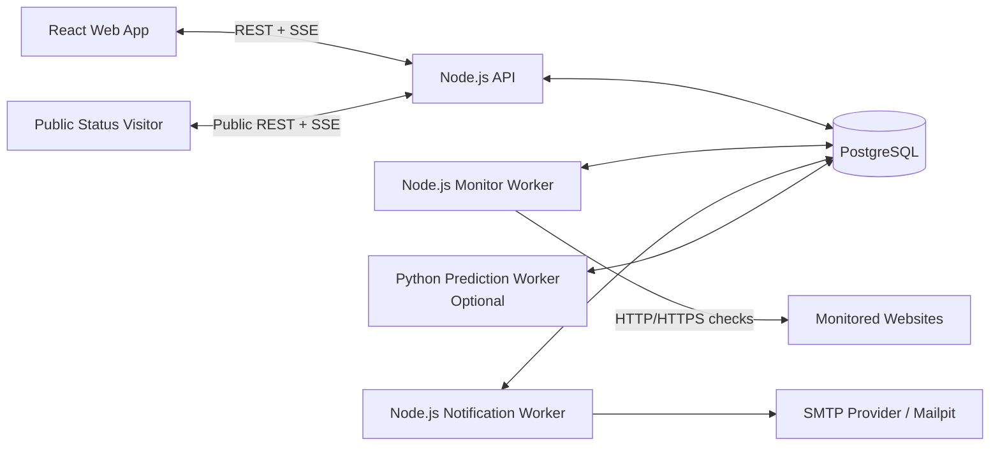

# Site Availability Monitor — Nihai Mimari (v1.2)

**Durum:** Aşama 1 domain kararlarıyla uyumlu mimari taban  
**Tarih:** 2026-10-09 22:58 +06:00  
**Kapsam:** İlk üretilebilir sürüm ve sonraki ölçekleme yönü

## 1. Mimari Özeti

Ürün; birbirinden ayrı bir React frontend, Node.js backend süreçleri, PostgreSQL veritabanı ve opsiyonel bir Python erken uyarı worker'ından oluşan modüler bir monolit olarak geliştirilecektir.

Ana ürünün çalışması yalnızca Node.js ve PostgreSQL bileşenlerine bağlıdır. Python tahmin sistemi sökülebilir bir yan özelliktir; durması, yavaşlaması veya hatalı sonuç üretmesi kontrolleri, incident yönetimini, normal e-postaları, API'yi, public durum sayfasını veya frontend'i durduramaz.

Sistem gerçek çok kullanıcılıdır. Her kullanıcı yalnızca kendi kaynaklarına erişebilir. Organizasyon, ekip üyeliği, davet ve rol yönetimi ilk sürümün kapsamında değildir.

Kontrol sayısı için 50 gibi sabit bir ürün limiti bulunmaz. Scheduler ve worker süreçleri küçük veya büyük kurulumlarda aynı veri modeliyle çalışır; kapasite worker sayısı ve concurrency ayarlarıyla artırılır.

### 1.1 Mimari değişmezler

- PostgreSQL kalıcı source of truth'tür; process belleği kalıcı iş veya domain durumu sayılmaz.
- Ana ürün predictor'a senkron çağrı veya başlangıç bağımlılığı taşımaz.
- Bir check sonucu önce kalıcı olarak yazılır; current state yalnızca geçerli config version ve en güncel fencing token tarafından ilerletilebilir.
- Kaçırılmış schedule tick'leri backfill edilmez ve hedef düşüşü olarak yorumlanmaz.
- Execution, health, maintenance ve freshness birbirinden ayrı durum eksenleridir.
- Availability zaman ağırlıklıdır; bilinmeyen süre ayrıca coverage olarak raporlanır.
- Domain değişikliği ile ona ait outbox olayı aynı transaction'da yazılır.
- Sabit ürün limiti yoktur; kaynak güvenliği için deployment tarafından yapılandırılan quota ve concurrency sınırları vardır.
- Bütün kalıcı domain zamanları UTC olarak saklanır.

## 2. Ana Kararlar

| Alan | Karar |
| --- | --- |
| Mimari biçim | Ayrı süreçleri olan modüler monolit |
| Frontend | React + TypeScript + Vite |
| Backend | Node.js + TypeScript + Fastify |
| Veritabanı | PostgreSQL |
| SQL erişimi | Typed repository katmanı; Kysely tercih edilir |
| API | REST + OpenAPI |
| Canlı güncelleme | Server-Sent Events (SSE) |
| İş kuyruğu | PostgreSQL tabanlı kalıcı işler ve lease mekanizması |
| Scheduler doğruluğu | Sabit cadence, heartbeat, fencing token ve stale-result reddi |
| E-posta | Node.js notification worker + transactional outbox + SMTP adapter |
| Yerel e-posta | Mailpit |
| Tahmin | Bağımsız ve opsiyonel Python analysis worker |
| Kullanıcı modeli | E-posta/parola hesabı ve kullanıcı bazlı sahiplik |
| Oturum | Güvenli HTTP-only cookie session |
| Availability | Zaman ağırlıklı durum süresi + ayrı data coverage |
| Yerel çalıştırma | Docker Compose |
| Redis | İlk sürümde kullanılmayacak |
| Mikroservisler | İlk sürümde kullanılmayacak |

Bu seçimlerin amacı; gereksiz dağıtık sistem karmaşıklığı oluşturmadan süreç izolasyonu, dayanıklılık ve yatay ölçekleme sağlamaktır.

## 3. Sistem Bağlamı



PostgreSQL sistemin kalıcı source of truth'üdür. `LISTEN/NOTIFY` yalnızca süreçleri yeni veriden haberdar etmek için kullanılır; kalıcı olay veya durum deposu olarak kullanılmaz.

## 4. Çalışma Süreçleri

### 4.1 Web

React uygulaması aşağıdaki ekranları sağlar:

- Giriş ve hesap yönetimi
- Kontrol listesi ve kontrol düzenleme
- Grup yönetimi
- Güncel durum paneli
- Kontrol detay ve geçmiş grafikleri
- Incident günlüğü
- Bakım pencereleri
- Bildirim alıcıları ve tercihleri
- Public sayfa yapılandırması
- Opsiyonel erken uyarı/risk görünümü

Sunucu verisi TanStack Query benzeri bir query-cache katmanıyla yönetilir. SSE yalnızca güncelleme sinyali ve küçük durum olayları taşır; bağlantı yeniden kurulduğunda doğru durum REST snapshot'ından alınır.

### 4.2 API

API süreci şu sorumluluklara sahiptir:

- Kimlik doğrulama ve oturum yönetimi
- Kullanıcı sahipliği ve yetkilendirme
- CRUD işlemleri
- Manuel kontrol talebi
- Geçmiş ve incident sorguları
- Public sayfa verisinin güvenli projection'ı
- SSE bağlantıları
- OpenAPI sözleşmesi

API hiçbir site kontrolünü veya e-posta gönderimini request lifecycle içinde çalıştırmaz.

### 4.3 Monitor Worker

Monitor worker aşağıdakileri yürütür:

- Zamanı gelen kontrolleri sahiplenme
- HTTP/HTTPS isteğini gerçekleştirme
- Timeout, beklenen durum kodu ve gövde metni kontrolü
- Ham sonucu kaydetme
- Güncel durum ve ardışık başarısızlık sayısını güncelleme
- Incident açma veya kapatma
- Sonraki çalışma zamanını belirleme
- İlgili domain/outbox olaylarını transaction içinde oluşturma

Birden fazla monitor worker aynı anda çalışabilir.

### 4.4 Notification Worker

Notification worker:

- Kalıcı notification işlerini sahiplenir.
- Bakım penceresi kurallarını uygular.
- Grup veya kullanıcı varsayılan alıcılarını çözümler.
- HTML ve düz metin e-posta üretir.
- SMTP adapter üzerinden gönderir.
- Retry, backoff, idempotency ve kalıcı hata durumunu yönetir.

E-posta sağlayıcısı erişilemez olduğunda ana monitoring akışı etkilenmez.

### 4.5 Python Prediction Worker

Prediction worker yalnızca yan özellik olarak çalışır:

- Sınırlı zaman aralığındaki rollup/feature verisini okur.
- İstatistiksel anomali ve trend analizi yapar.
- Risk skoru ve açıklama üretir.
- Sonucu yalnızca kendi prediction tablolarına yazar.

Prediction worker aşağıdakileri yapamaz:

- Kontrol zamanlamak veya çalıştırmak
- Ana kontrol durumunu değiştirmek
- Incident açmak veya kapatmak
- Normal `DOWN`/`RECOVERY` bildirimi üretmek
- API'nin veya başka worker'ların başlamasını engellemek

## 5. Kullanıcı ve Sahiplik İzolasyonu

Her alan kaynağı doğrudan bir kullanıcıya aittir. İlk sürümde organizasyon veya ortak çalışma modeli bulunmaz.

Temel ilkeler:

- `owner_id` istemcinin gönderdiği body'den güvenilir kabul edilmez; oturumdan alınır.
- Her kullanıcı sorgusu authenticated kullanıcı kapsamına alınır.
- Resource ID bilinse bile başka kullanıcıya ait kayıt okunamaz veya değiştirilemez.
- Composite foreign key veya eşdeğer veritabanı kısıtları, farklı sahiplerin kaynaklarının birbirine bağlanmasını engeller.
- Public endpoint'ler yönetim DTO'larını kullanmaz; yalnızca açıkça yayınlanan alanları döndürür.
- PostgreSQL Row-Level Security kullanıcıya ait tablolarda savunma katmanı olarak uygulanır.
- API, monitor worker, notification worker ve predictor farklı, en az yetkili veritabanı rolleri kullanır.

API request'i veritabanı transaction'ı içinde `SET LOCAL` benzeri transaction-scope kullanıcı bağlamı kurar. Böylece pooled connection başka bir request'e önceki kullanıcı bağlamını taşıyamaz. API rolü RLS bypass yetkisine sahip olmaz. Worker rolleri yalnızca görevleri için gerekli tablo ve işlemlere erişir.

Büyük ve partition edilmiş zaman serisi tablolarında sahip kimliği doğrudan saklanır. `(resource_id, owner_id)` composite anahtarları veya eşdeğer kısıtlar, farklı kullanıcılara ait kaynakların birbirine bağlanmasını veritabanı seviyesinde engeller. RLS yalnız başına yetkilendirme sistemi değildir; API policy kontrolü, veritabanı kısıtları ve negatif entegrasyon testleri birlikte kullanılır.

Kimlik doğrulama için:

- Parolalar Argon2id gibi güncel ve güçlü bir password hashing algoritmasıyla saklanır.
- Oturum cookie'si `HttpOnly`, `Secure` ve uygun `SameSite` ayarlarına sahip olur.
- Session rotation, logout ve süre sonu desteklenir.
- State değiştiren endpoint'ler CSRF yaklaşımıyla korunur.
- Giriş ve hassas endpoint'lerde rate limiting uygulanır.

## 6. Ana Veri Modeli

Tablo isimleri uygulama geliştirilirken küçük değişiklikler gösterebilir; sahiplik ve sorumluluk sınırları değişmemelidir.

### Kimlik ve yapılandırma

- `users`
- `sessions`
- `check_groups`
- `checks`
- `notification_recipients`
- `notification_preferences`
- `public_status_pages`
- `public_status_components`
- `audit_events`

Bir kontrol sıfır veya bir gruba aittir. Bu seçim grup durumu, bakım ve alıcı kurallarındaki belirsizliği önler. Bir grup silinirse kontroller kullanıcı onayıyla gruptan çıkarılır veya birlikte silinir; davranış API sözleşmesinde açıkça belirtilir.

### Çalışma durumu ve geçmiş

- `check_current_states`
- `check_jobs`
- `check_runs`
- `check_rollups`
- `incidents`
- `maintenance_windows`
- `maintenance_targets`
- `system_tasks`

### Olay ve e-posta

- `outbox_events`
- `notification_deliveries`

### Tahmin

- `analysis_jobs`
- `prediction_scores`
- `prediction_model_versions`

Tahmin tabloları boş veya predictor tamamen kapalı olsa bile diğer tabloların davranışı değişmez.

Genel optimistic concurrency için `resource_version`, probe anlamını değiştiren alanlar için `probe_generation`, scheduling anlamını değiştiren alanlar için `schedule_generation` ayrı tutulur. Job ve run kayıtları çalışmanın başladığı andaki generation değerleri ve config snapshot'ını taşır. Current-state satırları kabul edilen son fencing token/sequence değerini saklar. Böylece geç veya yeniden oynatılan bir sonuç geçmişe tanısal veri olarak kaydedilebilse bile güncel sağlık durumunu geriye götüremez.

## 7. Scheduler ve Kontrol Çalıştırma

Her aktif kontrol en az şu alanlara sahiptir:

- URL
- Kontrol aralığı: 30 saniye–1 saat
- Timeout
- Beklenen HTTP durum kodu
- Opsiyonel beklenen gövde metni
- `next_run_at`
- Aktif/duraklatılmış durumu

Scheduler yalnızca zamanı gelen kontrolleri indeksli sorgularla küçük partiler halinde alır. Kontrollerin tamamı belleğe yüklenmez.

Sahiplenme mekanizması PostgreSQL transaction'ı, `FOR UPDATE SKIP LOCKED`, süreli lease, heartbeat ve monoton fencing token kullanır. Aynı kontrol için queued/running işi tekilleştiren bir veritabanı kısıtı bulunur. Lease süresi kontrol timeout'u ve güvenlik payından uzun seçilir; worker lease'i düzenli olarak yeniler.

Periyodik plan sabit cadence kullanır. `next_run_at`, planlanan zaman dizisinde mevcut zamandan sonraki ilk uygun zamana ilerletilir. Kaçırılmış tick'ler için birikmiş işler üretilmez. Manuel çalışma periyodik cadence'i değiştirmez.

Temel akış:

1. Scheduler zamanı gelen kontrolü atomik olarak sahiplenir.
2. İş için yeni fencing token ve o andaki config snapshot/version kaydedilir.
3. `check_jobs` kaydı oluşturulur ve `next_run_at` gelecekteki ilk cadence noktasına ilerletilir.
4. Worker isteği timeout ve response-size limitleriyle çalıştırır; lease kaybında isteği abort etmeye çalışır.
5. Sonuç `check_runs` tablosuna tanısal gerçek olarak yazılır.
6. Current-state satırı kilitlenir; yalnızca güncel config version ve en yeni fencing token sonucu state/incident'a uygulanır.
7. Güncel durum, incident ve gerekli outbox olayları aynı transaction içinde güncellenir.
8. Lease tamamlanmış duruma geçirilir.

Aynı kontrol hâlen çalışırken yeni periyodik iş başlatılmaz. Manuel çalıştırma talebi gelirse en fazla bir bekleyen manuel iş olarak birleştirilir ve mevcut çalışma tamamlanınca gerçekleştirilir. ACTIVE check'teki manual run stateful'dur; PAUSED check'teki manual run diagnostic olarak kaydedilir ve health/incident/availability/bildirimi değiştirmez. Aynı dış hedefe matematiksel exactly-once HTTP isteği garanti edilemez; garanti edilen davranış normal koşullarda tek aktif execution ve yalnızca tek, güncel fencing token'lı sonucun domain state'e kabul edilmesidir.

Worker veya sunucu kapalıyken kaçırılan zaman dilimleri geriye dönük çalıştırılmaz ve başarısızlık olarak kaydedilmez. Yeniden başlatmadan sonra kontroller güncel zamandan devam eder. Geçmiş grafiğinde bu süre veri boşluğu olarak görünür.

İlk kurulum ve toplu yeniden başlatmalarda thundering herd oluşmaması için çalışma zamanlarına kontrollü jitter uygulanır.

Graceful shutdown sırasında worker yeni iş almayı durdurur, aktif isteği tanımlı drain süresinde tamamlamaya çalışır ve tamamlayamadığı işi güvenle yeniden sahiplenilebilir bırakır. Stale lease temizliği idempotent bir housekeeping görevidir.

## 8. Kapasite ve Yatay Ölçekleme

Kontrol adedi için sabit bir uygulama limiti yoktur. Sistem 20, 200 veya 500 kontrol için aynı mekanizmayı kullanır.

Sabit ürün limiti olmaması sınırsız kaynak tüketimi anlamına gelmez. Aktif kontrol quota'sı, manuel-run rate limit'i, global ve kullanıcı bazlı concurrency, hostname concurrency, timeout, response-size ve SSE connection sınırları deployment kapasitesine göre yapılandırılır. Bu değerler domain kodunda 50 gibi sabit sayılara bağlanmaz.

Yaklaşık gereken concurrency şu şekilde değerlendirilir:

```text
gereken concurrency ≈ saniyedeki kontrol sayısı × p95 istek süresi
```

500 kontrolün tamamı 30 saniyelik aralıkla çalışırsa ortalama başlangıç hızı yaklaşık 16,7 istek/saniyedir. Gerçek kapasite timeout, hedef gecikmeleri ve hata dağılımına göre ölçülür.

Kaynak koruması:

- Worker concurrency yapılandırılabilir.
- Worker replica sayısı artırılabilir.
- Kullanıcı başına adil tüketim uygulanır; bir kullanıcı bütün kuyruğu kaplayamaz.
- Hedef hostname başına concurrency sınırı uygulanır.
- Açık bağlantı, response boyutu ve toplam timeout sınırlandırılır.
- Kuyruk baskısı altında yeni manuel işler kontrollü biçimde rate-limit edilir.
- Kuyruk gecikmesi, aktif işler ve timeout oranı metrik olarak izlenir.

50 kontrol bir ürün sınırı değil, performans test profillerinden biridir. Yük testleri en az 20, 200 ve 500 kontrol senaryolarını kapsamalıdır.

## 9. Kontrol Durumu ve Incident State Machine

Kontrol durumu tek enum yerine dört bağımsız eksende tutulur:

```text
execution:   ACTIVE | PAUSED
health:      UNKNOWN | UP | SUSPECT | DOWN
maintenance: true | false
freshness:   FRESH | STALE
```

- `UNKNOWN`: Henüz geçerli sonuç yoktur veya mevcut sonuç güvenilir güncellik sınırını aşmıştır.
- `UP`: Son doğrulanmış sağlık durumu başarılıdır.
- `SUSPECT`: İlk başarısızlık görülmüştür fakat kesinti eşiği aşılmamıştır.
- `DOWN`: Ardışık başarısızlık eşiği aşılmış ve incident açılmıştır.
- `PAUSED`: Yalnızca execution eksenidir; son health bilgisi geçmiş gerçek olarak korunabilir.

Bakım health durumunun yerine geçmez. Örneğin bir kontrol aynı anda `ACTIVE`, `DOWN`, `under_maintenance=true` ve `FRESH` olabilir. Freshness sınırı interval ve scheduler toleransından türetilir. Unpause sonrasında yeni geçerli sonuç gelene kadar görünür sağlık `UNKNOWN/STALE` olarak ele alınır.

Başlangıç eşiği iki ardışık başarısızlıktır:

- İlk başarısızlık ham geçmişe yazılır ve durum `SUSPECT` olur.
- İkinci ardışık başarısızlıkta incident görünür hale gelir.
- Incident'ın `started_at` zamanı ilk başarısız gözlemin zamanıdır.
- İlk başarılı kontrol incident'ı kapatır.
- Sonraki başarısız kontroller aynı açık incident'a aittir.

Incident gerçekten gözlemlenmiş DOWN segmentlerinden oluşabilir. Freshness STALE veya check PAUSED olduğunda aktif segment kapanır; incident açık fakat `UNOBSERVED` kalabilir. Sonraki FAIL aynı incident'ta yeni segment başlatır, sonraki PASS incident'ı recovery ile kapatır. UNKNOWN/data-gap süresi incident'ın observed duration değerine eklenmez.

Eşik ileride kontrol bazında yapılandırılabilir; ilk sürümde sistem varsayılanı olarak tutulabilir.

Grup durumu, gruptaki kontrollerin en kötü aktif durumundan türetilir. `DOWN`, `SUSPECT`, `UNKNOWN`, `UP` önceliği uygulanır; tüm kontroller duraklatılmışsa grup `PAUSED` gösterilir.

## 10. Bakım Pencereleri

Bakım penceresi tek bir kontrole veya bir gruba uygulanabilir. İlk sürüm belirli başlangıç ve bitiş zamanına sahip tek seferlik pencereleri destekler. Bütün zamanlar UTC saklanır ve pencere `[starts_at, ends_at)` olarak değerlendirilir. Örtüşen pencereler birleşimdir; herhangi biri aktifken bildirim bastırma devam eder. Tekrarlayan bakım kuralları ayrı bir geliştirme olarak eklenebilir.

Bakım sırasında:

- Kontroller normal şekilde çalışır.
- Sonuçlar ve grafikler güncellenir.
- Durum ve incident hesaplanır.
- Arayüz gerçek durumu bakım etiketiyle gösterir.
- Normal bildirimler gönderilmez.

Davranış kuralları:

- Incident bakım sırasında başlayıp bakım sırasında kapanırsa e-posta gönderilmez.
- Incident bakım sırasında başlayıp bakım sonunda hâlâ açıksa bakım biter bitmez bir `DOWN` bildirimi oluşturulur.
- `DOWN` bildirimi bakımdan önce gönderilmiş ve recovery bakım sırasında gerçekleşmişse recovery bildirimi bakım sonuna ertelenir.
- Notification worker SMTP çağrısından hemen önce bakım durumunu yeniden doğrular.
- Ertelenmiş teslimatlar `not_before` taşır fakat gönderim anında güncel incident, bakım ve önceki delivery durumu tekrar okunur.
- Aktif bakımın uzatılması, kısaltılması, silinmesi ve kontrolün grup değiştirmesi reconciliation işi tarafından idempotent biçimde yeniden değerlendirilir.

## 11. E-posta Mimarisi

Normal bildirim olayları:

- `INCIDENT_OPENED`
- `INCIDENT_RECOVERED`

Opsiyonel tahmin olayı:

- `PREDICTIVE_WARNING`

Incident güncellemesi ve outbox olayı aynı PostgreSQL transaction'ında yazılır. Notification worker kalıcı olayları teslimat kayıtlarına dönüştürür.

Alıcı modeli:

- Kullanıcının varsayılan doğrulanmış alıcıları olabilir.
- Her grup kendi alıcı listesini kullanabilir veya kullanıcı varsayılanlarını devralabilir.
- Yeni alıcılar doğrulanmadan operasyonel bildirim alamaz.
- Tahmin bildirimleri normal incident bildirimlerinden ayrı açılıp kapatılabilir.

Tekrarsızlık için `incident_id + event_type + recipient` benzersizdir. Sürekli başarısız kontroller yeni e-posta üretmez.

Gönderim durumları en az `pending`, `processing`, `sent`, `retry`, `failed` ve `cancelled` değerlerini içerir. Hatalarda exponential backoff ve jitter uygulanır.

Incident, `DOWN` e-postası gönderilmeden kapanırsa bekleyen `DOWN` iptal edilir ve `RECOVERY` gönderilmez. `DOWN` gönderilmişse aynı alıcılara recovery gönderilir.

DOWN teslimatının alıcıları gerçek gönderim anındaki etkin grup/kullanıcı tercihinden çözülür. RECOVERY, daha önce o incident için başarılı DOWN teslimatı almış recipient kayıtlarına gönderilir; böylece ayar değişikliği kapanış mesajını yanlış kişilere yönlendirmez.

Yerel geliştirmede Mailpit; üretimde standart SMTP veya adapter üzerinden başka bir sağlayıcı kullanılır. SMTP matematiksel exactly-once garantisi vermediği için sistem uygulama seviyesinde tek teslimat kaydı ve sabit `Message-ID` kullanır; taşıma seviyesi at-least-once gerçeği dokümante edilir.

E-postalarda response body bulunmaz. URL query değerleri ve potansiyel gizli bilgiler maskelenir.

## 12. Geçmiş, Availability ve Grafikler

500 kontrolün 30 saniyelik aralıkla çalışması ayda yaklaşık 43,2 milyon ham sonuç üretebilir. Bu nedenle panel ve grafik sorguları birbirinden ayrılır.

- Güncel panel yalnızca `check_current_states` tablosunu okur.
- `check_runs` zaman bazlı aylık partition'lara ayrılır.
- En önemli indeks `(check_id, finished_at)` eksenindedir ve sahiplik sorguları desteklenir.
- `check_rollups` dakika/saat kovalarında ölçüm sayısı, başarı sayısı, hata sayısı, response-time özetleri ve durum sürelerini tutar.
- Ham veri retention süresi yapılandırılır; başlangıç varsayılanı en az aylık görünümü karşılayacak şekilde belirlenir.

Grafik çözünürlüğü istenen döneme göre düşürülür:

- Gün: dakika veya 5 dakikalık kovalar
- Hafta: 15 dakika veya saatlik kovalar
- Ay: saatlik kovalar

Availability completed-run sayılarının oranıyla değil, bilinen gözlem süresindeki durum zaman çizelgesiyle hesaplanır:

```text
availability = UP süresi / (UP süresi + DOWN süresi)
coverage = bilinen gözlem süresi / seçilen toplam süre
```

`SUSPECT` aralığı bir sonraki sonuç gelene kadar provisional'dır. Sonraki başarısızlık incident'ı doğrularsa ilk başarısız gözlemden itibaren DOWN olarak; sonraki başarı eşik geçilmeden gelirse doğrulanmış downtime olmadığı için UP olarak finalize edilir. Başarısız run her iki durumda da response/error geçmişinde görünmeye devam eder. UNKNOWN/no-data hiçbir koşulda DOWN sayılmaz ve availability paydasına girmez. Monitor servisinin çalışmadığı aralık `null`/veri yok olarak dönülür ve grafikte boşluk şeklinde gösterilir. Availability ile coverage birlikte sunulur.

Rollup üretimi, geç finalize edilen interval düzeltmesi, gelecek partition'ların oluşturulması ve retention; aynı repository/domain içindeki ayrı `housekeeping-worker` deployment process'inde çalışır. Bu process public API veya bağımsız veri sahipliği olan bir mikroservis değildir; ağır aggregate/DDL/purge işlerini API ve probe pool'undan izole eder. Durable range'ler `SKIP LOCKED`, minute/hour lane'leri bounded advisory lock, partition DDL'i ayrı advisory lock kullanır. Queue lease recovery ve notification/maintenance reconciliation ise verinin sahibi olan worker runtime'larında kalır.

## 13. Canlı Güncelleme

Durum değişimleri API tarafından SSE ile yayınlanır. Yönetim ve public kanallar ayrıdır.

- Authenticated kanal yalnızca oturum sahibinin kaynaklarını yayınlar.
- Public kanal yalnızca ilgili public sayfada izin verilen projection'ı yayınlar.
- Worker veriyi önce PostgreSQL'e yazar, sonra `NOTIFY` ile API'yi uyandırır.
- `NOTIFY` kaybolsa bile veritabanındaki güncel durum korunur.
- SSE yeniden bağlandığında frontend REST snapshot'ı alarak tutarlılığı sağlar.
- SSE heartbeat, bağlantı başına limit ve IP/kullanıcı rate limit uygular.
- Reverse proxy buffering kapatılır; istemci SSE kullanılamadığında düşük sıklıklı polling'e düşebilir.
- Authenticated ve public bağlantı bütçeleri ayrılır; yüksek public trafik özel kullanıcı panelini tüketemez.

WebSocket, çift yönlü sürekli iletişim ihtiyacı olmadığı için ilk sürümde kullanılmaz.

## 14. Public Durum Sayfası

Her kullanıcı bir veya daha fazla public sayfa yapılandırabilir. Sayfa yüksek entropili, döndürülebilir ve iptal edilebilir bir slug üzerinden girişsiz açılır. Slug bir paylaşım anahtarıdır; arama motoru keşfi veya tahmine karşı ek rate limit uygulanır.

Kullanıcı aşağıdakileri ayrı ayrı yayınlayabilir:

- Seçili gruplar
- Seçili kontroller
- Kontrolün görünen adı
- Teknik durum
- Response time
- Incident geçmişi
- Gerçek hedef URL

Gerçek URL varsayılan olarak gizli tutulur. Public sorgular hiçbir zaman kullanıcı ayarlarını, alıcı adreslerini, gizli URL bölümlerini veya yayın izni olmayan kaynakları döndürmez.

Public snapshot kısa süreli ve güvenli biçimde cache edilebilir. Cache anahtarı page revision içerir; sayfa kapatıldığında veya slug döndürüldüğünde eski cache girdisi geçerli yanıt üretemez.

## 15. Python Erken Uyarı Sistemi

Bu özellik ana ürünün source of truth'ü değildir ve arayüzde deneysel/erken uyarı niteliğinde sunulur.

İlk aşama açıklanabilir istatistiksel yöntemleri kullanır:

- Hareketli ortalama ve EWMA
- Z-score veya sağlam sapma ölçüleri
- Gecikme trendi
- Timeout ve 5xx oranı
- Davranış volatilitesi
- Değişim noktası tespiti
- Siteye özel saatlik/günlük baseline

Yeterli etiketli incident verisi oluşmadan denetimli "çökme tahmin modeli" kurulmaz. Daha sonra hedef açıkça şu şekilde tanımlanabilir: önümüzdeki 5/15/30 dakika içinde incident oluşma olasılığı.

Tahmin kaydı en az şunları içerir:

- Kontrol ve sahip kimliği
- Hesaplama zamanı
- Tahmin ufku
- Risk skoru ve seviyesi
- Geçerlilik süresi
- Model sürümü
- Kullanılan feature snapshot'ı
- İnsan tarafından okunabilir nedenler

Predictor her check sonucunda zorunlu olarak çalışmaz; örneğin 3–5 dakikalık aralıklarla güncel pencereyi analiz edebilir. Kapalı kaldığında eski işleri tek tek tüketmek yerine kontrol başına en yeni analiz talebini birleştirir.

Kaynak izolasyonu:

- Ayrı container/process
- Sınırlı CPU ve bellek
- Küçük DB connection pool
- SQL statement timeout
- Yalnızca indeksli ve zaman aralığı sınırlı sorgular
- Kendi tabloları dışında yazma yetkisi yok
- Feature flag ile tamamen kapatılabilir

Frontend prediction verisini ayrı endpoint'ten yükler. Sonuç yoksa veya eskimişse ana dashboard hata vermez; "tahmin kullanılamıyor" ya da "tahmin güncel değil" gösterir.

## 16. URL Güvenliği ve SSRF Koruması

Kullanıcı tarafından girilen URL'ler önemli bir SSRF riskidir. Aşağıdaki kontroller zorunludur:

- Yalnızca HTTP ve HTTPS protokolleri
- URL içindeki kullanıcı adı/parolanın reddedilmesi
- Localhost, private, loopback, link-local, multicast ve cloud metadata adreslerinin engellenmesi
- DNS çözümlemesinden sonra IP doğrulaması
- Bağlantının doğrulanan IP'ye pinlenmesi; Host header ve TLS SNI'ın hedef hostname olarak korunması
- Her redirect hedefinde yeniden doğrulama
- Redirect sayısı sınırı
- DNS, bağlantı, TLS, first-byte ve toplam istek timeout'u
- Response body boyutu sınırı
- Beklenen string aramasında sınırlı buffer veya streaming yaklaşımı
- Ham response body'nin kalıcı olarak saklanmaması
- Log ve e-postalarda query/credential maskeleme

DNS'i doğrulayıp HTTP client'ın aynı hostname'i kontrolsüz biçimde yeniden çözmesine izin vermek TOCTOU açığı oluşturur. DNS rebinding, IPv4/IPv6 adres sınıfları ve redirect üzerinden iç ağa geçiş gerçek bağlantı düzeyinde testlerle doğrulanmalıdır. İlk sürüm public internet hedefleri içindir; private network monitoring ayrı bir probe mimarisi gerektirir.

## 17. API Yüzeyi

Kesin endpoint isimleri OpenAPI tasarımı sırasında sabitlenecektir. Ana kaynaklar:

```text
/auth
/checks
/groups
/maintenance-windows
/incidents
/notification-settings
/public-pages
/history
/events
```

Manuel kontrol bir komut endpoint'i üzerinden kalıcı işe dönüştürülür. Uzun işlemler request içinde bekletilmez. Hata yanıtları tutarlı bir problem-details biçimi kullanır.

Public API, authenticated API'den ayrı route ve response modellerine sahiptir.

## 18. Repository Yapısı

```text
apps/
  web/                    # React frontend
  api/                    # Fastify API ve SSE
  monitor-worker/         # Scheduler ve HTTP kontrolleri
  notification-worker/    # Outbox ve e-posta teslimatı
  target-simulator/       # Başarı, hata, gecikme ve hang senaryoları

services/
  predictor/              # Opsiyonel Python analysis worker

packages/
  domain/                 # Framework bağımsız iş kuralları ve state machine
  database/               # Migration/repository ve transaction yardımcıları
  check-engine/           # Güvenli HTTP kontrol motoru
  notifications/          # Bildirim politikaları ve şablonlar
  contracts/              # API/event sözleşmeleri
  config/                 # Ortak Node yapılandırması
  observability/          # Log/metric yardımcıları
  testing/                # Ortak test araçları

database/
  migrations/
  seeds/

docs/
  ARCHITECTURE.md
  DECISIONS.md
  DEVELOPMENT_LOG.md
  AI_USAGE.md
  PROJECT_STATUS.md
  NEXT_STEPS.md

infra/
  docker/
```

Node uygulamaları tek workspace içinde yönetilir. API ve worker dizinleri entrypoint/composition root olarak kalır; domain, state machine, repository ve notification kuralları uygulamalar arasında kopyalanmaz. Python bağımlılıkları predictor dizininde bağımsız ve kilitli tutulur.

## 19. Yerel Çalıştırma ve Dağıtım

Docker Compose en az şu servisleri sağlar:

- `web`
- `api`
- `monitor-worker`
- `notification-worker`
- `postgres`
- `mailpit`
- `target-simulator`
- `predictor` — opsiyonel profile

Predictor compose profile ile açılıp kapatılabilir. API ve diğer worker'lar predictor için `depends_on` bağımlılığı taşımaz.

Üretimde aynı container imajından birden fazla monitor veya notification worker replica'sı çalıştırılabilir. İlk sürüm Kubernetes gerektirmez; container sözleşmeleri daha sonraki deployment ortamlarına taşınabilir biçimde tutulur.

Yerel ve üretim veri tabanı profilleri farklıdır. Yerelde tek PostgreSQL container yeterlidir. Üretim profili managed veya primary/standby PostgreSQL, otomatik backup, point-in-time recovery, periyodik restore testi, connection pooling, disk/transaction izlemesi ve tanımlı RPO/RTO içerir. Repository'nin tam HA altyapısını kurması zorunlu değildir; operasyon sözleşmesi ve doğrulama prosedürü belgelenir.

Migration'lar expand/contract yaklaşımıyla geriye uyumlu aşamalara ayrılır. Deployment sırasında tek bir migration job çalışır; API ve worker'lar desteklenmeyen şema sürümünde readiness vermez. Worker'lar kapanırken yeni iş almayı bırakıp aktif işleri drain eder.

## 20. Gözlemlenebilirlik

Tüm Node ve Python süreçleri yapılandırılmış JSON log üretir. Loglar en az şu bağlamları taşır:

- Request veya correlation ID
- Kullanıcı/sahip kimliği — hassas olmayan biçimde
- Check ID
- Job/run ID
- Incident ID
- Worker adı ve sürümü

Temel metrikler:

- Zamanı gelen ve geciken kontrol sayısı
- Aktif iş ve lease sayısı
- Kontrol süresi ve timeout oranı
- Durum kodu/hata dağılımı
- Açık incident sayısı
- Outbox ve e-posta kuyruğu gecikmesi
- Gönderim başarısı ve retry sayısı
- SSE bağlantı sayısı
- Rollup gecikmesi
- Prediction yaşı, hata ve backlog değeri
- Veritabanı connection kullanımı, replication/backup yaşı ve disk baskısı
- Public ve authenticated SSE connection bütçeleri

API, worker ve predictor için ayrı liveness/readiness sinyalleri bulunur. Predictor sağlıksızlığı ana sistem readiness sonucunu etkilemez.

Kullanıcı girişi, oturum iptali, check/group/maintenance/public-page değişiklikleri ve bildirim alıcısı değişiklikleri hassas değer içermeyen audit kayıtları üretir. Secret, token, response body ve URL query değerleri merkezi redaction politikasına tabidir.

## 21. Test ve Kanıtlama Stratejisi

### Birim testleri

- Durum makinesi
- Incident eşiği
- Bakım-bildirim kararları
- Availability hesaplama
- Grup durumunun türetilmesi
- Prediction skor açıklamaları

### Entegrasyon testleri

- PostgreSQL lease ve `SKIP LOCKED`
- Birden fazla worker'ın aynı kontrolü almaması
- Lease kaybı ve eski fencing token sonucunun reddedilmesi
- Connection pool üzerinde RLS kullanıcı bağlamının sızmaması
- Transactional outbox
- Tenant/kullanıcı izolasyonu
- RLS ve composite sahiplik kısıtları
- Partition ve rollup sorguları
- SMTP hata ve retry davranışı

### Uçtan uca testler

- Kontrol ekleme, duraklatma, sürdürme, silme ve manuel çalıştırma
- İki tarayıcıda otomatik durum güncellemesi
- Tek hata sonrası `SUSPECT`, eşik sonrası `DOWN`
- Tek `DOWN` ve tek `RECOVERY` e-postası
- Bakım sırasında sessizlik ve bakım sonrası bildirim
- Public sayfadaki alan izinleri
- Sunucu yeniden başlatma ve geçmişte veri boşluğu

### Dayanıklılık testleri

- Predictor kapalıyken sistemin tam çalışması
- SMTP kapalıyken kontrollerin devam etmesi
- Bir monitor worker'ın işlem sırasında öldürülmesi
- PostgreSQL yeniden başlatma ve restore prosedürü
- Yavaş/hang hedefin diğer kontrolleri engellememesi
- 20, 200 ve 500 kontrol profilleri
- Predictor backlog'unun API gecikmesini etkilememesi

## 22. Bilinçli Olarak İlk Sürüme Alınmayanlar

- Organizasyon, ekip üyeliği ve rol yönetimi
- Mikroservis altyapısı
- Redis/Kafka tabanlı kuyruk
- Kubernetes zorunluluğu
- Çok bölgeli probe ağı
- Tekrarlayan bakım takvimleri
- Yeterli veri oluşmadan denetimli ML modeli
- Predictor'ın gerçek durum veya incident yönetimine müdahalesi

Bu alanlar ancak ölçülen ihtiyaç veya yeni ürün gereksinimi oluşursa değerlendirilir.

## 23. Mimari Başarı Kriterleri

Mimari aşağıdaki koşullar doğrulandığında hedefini karşılamış kabul edilir:

- Kullanıcılar birbirlerinin kaynaklarına hiçbir endpoint üzerinden erişemez.
- Aynı kontrol kendisiyle paralel çalışmaz.
- Bir yavaş hedef diğer hedefleri ve API'yi geciktirmez.
- Worker sayısı artırıldığında kod veya veri modeli değişmez.
- Server kapalıyken geçen süre düşüş olarak değil veri boşluğu olarak görünür.
- Tek incident için tekrarlanan başarısızlıklar e-posta fırtınası oluşturmaz.
- Bakım penceresi kontrolleri durdurmadan bildirimleri doğru biçimde bastırır.
- Aylık geçmiş veri hacminden bağımsız olarak özet tablolardan hızlı açılır.
- Public sayfa yalnızca sahibin açıkça yayınladığı alanları gösterir.
- Predictor ve SMTP tamamen kapalıyken ana monitoring ürünü çalışmaya devam eder.
- Lease kaybı veya geç sonuç current state'i geriye götürmez.
- Availability interval değişiminden etkilenmeyen zaman ağırlıklı sonuç ve ayrı coverage üretir.
- Kurulum, migration, seed, test ve demo akışları temiz bir ortamda tekrarlanabilir.
