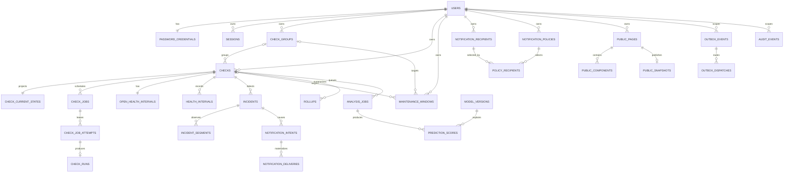

# Veritabanı ve Kalıcılık Mimarisi

**Aşama:** 3 — Nihai Veritabanı ve Kalıcılık Mimarisi  
**Durum:** Uygulandı ve yerel PostgreSQL üzerinde doğrulandı
**Tarih:** 2026-10-10  
**Hedef platform:** PostgreSQL 18.6

> Bu belge ve bağlı belgeler normatif tasarım sözleşmesidir. Tasarım 2026-10-10 tarihinde onaylanmış; altı forward-only migration, idempotent demo seed'i, tipli erişim katmanı ve entegrasyon testleriyle uygulanmıştır.

## 1. Belge Seti

- Bu belge: sınırlar, kalıcılık ilkeleri, aggregate eşlemeleri ve ER modeli
- [`DATABASE_SCHEMA.md`](./DATABASE_SCHEMA.md): tablo/kolon sözlüğü ve bütünlük kısıtları
- [`DATABASE_SECURITY.md`](./DATABASE_SECURITY.md): RLS, roller, yetkiler ve güvenli erişim akışları
- [`DATABASE_OPERATIONS.md`](./DATABASE_OPERATIONS.md): indeks/sorgu, partition, rollup, retention, migration, backup ve restore planı
- [`DATABASE_RESTORE_TEST.md`](./DATABASE_RESTORE_TEST.md): local mantıksal geri yükleme prova kaydı ve sınırları

Çelişki halinde sıralama `REQUIREMENTS.md` → `DOMAIN_MODEL.md`/`STATE_MACHINES.md` → bu belge seti → uygulama biçimindedir. Uygulamanın belgeye uymadığı durumda belge sessizce değiştirilmez; karar günlüğüyle birlikte revize edilir.

## 2. Amaçlar ve Sınırlar

Veritabanı tasarımı aşağıdaki özellikleri birlikte sağlar:

- Gerçek çok kullanıcılı yapı ve kullanıcılar arasında katı sahiplik izolasyonu
- Kullanıcı başına sabit bir check sayısı varsaymadan yatay worker ölçeklenmesi
- Kalıcı scheduler queue, lease, heartbeat ve fencing token semantiği
- Dashboard için ham geçmişten bağımsız, hızlı current-state okuması
- Incident eşik ve gözlem aralığı semantiğinin kayıpsız tutulması
- Bakım penceresi sırasında ölçmeye devam edip bildirimi erteleme
- Aynı incident geçişi için tek bildirim üretme
- Public sayfanın yalnızca açıkça izin verilen alanları sunması
- Gün/hafta/ay geçmişini bounded sorgular ve rollup'larla hızlı açma
- Predictor'ın ana sağlık durumunu değiştiremeyen, opsiyonel bir yan sistem olması
- Kesinti süresini DOWN olarak uydurmadan veri boşluğu olarak gösterebilme
- Online ve ileri yönlü migration, yedekleme ve doğrulanmış geri yükleme

İlk sürümde organizasyon/workspace modeli yoktur. Bütün özel aggregate'lar doğrudan bir `owner_id` ile kullanıcıya aittir. İleride organizasyon eklenmesi ayrı bir domain ve veri migration kararı olacaktır.

## 3. Ana Tasarım Kararları

### 3.1 PostgreSQL kaynak gerçektir

PostgreSQL; kullanıcı, yapılandırma, queue, current state, incident, bildirim ve geçmiş için tek kalıcı kaynak gerçektir. Redis, message broker veya ayrı bir time-series veritabanı v1 için zorunlu değildir. PostgreSQL outbox ve kalıcı job tabloları süreçler arası koordinasyonu sağlar.

### 3.2 SQL-first şema, Kysely ile tipli erişim

PostgreSQL'e özgü RLS, partition, partial index, constraint ve rol tanımlarının görünür kalması için migration'lar sürümlü düz SQL olacaktır. Uygulama sorguları `pg` transaction altyapısı üzerinde Kysely ile tipli yazılacaktır. Migration yaşam döngüsü ORM model senkronizasyonuna bırakılmayacaktır.

### 3.3 Kimlikler ve sürümler

- Aggregate ve event kimlikleri PostgreSQL 18 `uuidv7()` ile üretilen `uuid` değerleridir.
- UUIDv7 indeks locality'sini iyileştirir; fakat yetkilendirme veya gizli link olarak kullanılmaz.
- Public link ve session token'ları en az 256 bit rastgele değerdir; yalnızca SHA-256 digest'i saklanır.
- Optimistic concurrency için `resource_version bigint`, probe anlamı için `probe_generation bigint`, cadence için `schedule_generation bigint`, çalışan attempt sırası için monoton `fencing_token bigint` kullanılır.
- Sayaçlar `1` ile başlar ve yalnızca ilgili semantik değiştiğinde artar.

### 3.4 Zaman semantiği

- Bütün anlar `timestamptz` ve UTC olarak saklanır; istemci saat dilimi yalnızca sunum bilgisidir.
- Süreler tam sayı milisaniye veya saniyedir; floating point süre kullanılmaz.
- Aralıklar yarı açık `[start, end)` biçimindedir.
- Veritabanı zamanı gerektiren lease/freshness kararları `statement_timestamp()`/`clock_timestamp()` ile verilir; uygulama host saatine güvenilmez.
- `created_at` geçmiş olay zamanı değil, satırın veritabanına yazılma zamanıdır. Run için gerçek sıralama `scheduled_for`, `started_at`, `finished_at` alanlarıyla yapılır.

### 3.5 Durumlar text + CHECK constraint'tir

Sık evrilen durum makineleri PostgreSQL enum yerine `text NOT NULL` ve isimlendirilmiş `CHECK` constraint'leriyle korunur. Bu yaklaşım online migration'da yeni durum eklemeyi kolaylaştırırken veritabanı doğrulamasını korur. Uygulama tarafındaki union/enum değerleri aynı sözleşmeden test edilir.

### 3.6 Sahiplik tek kolona emanet edilmez

- Tenant'a ait her tabloda doğrudan `owner_id` bulunur; zincirleme join ile türetilmez.
- Ebeveynler `(owner_id, id)` unique anahtarını taşır.
- Çocuk tablolar `(owner_id, parent_id)` composite foreign key kullanır; farklı kullanıcıların kaynakları bağlanamaz.
- Bütün private tablolar `ENABLE ROW LEVEL SECURITY` ve `FORCE ROW LEVEL SECURITY` kullanır.
- API domain yetkilendirmesi birinci katman, composite constraint ikinci katman, RLS üçüncü katmandır.

### 3.7 Kaynak gerçekleri ve projection'lar ayrıdır

| Veri                                  | Tür                             |                                                             Yeniden oluşturulabilir mi? |
| ------------------------------------- | ------------------------------- | --------------------------------------------------------------------------------------: |
| Check/group/user yapılandırması       | Kaynak gerçek                   |                                                                                   Hayır |
| Job, attempt ve accepted/rejected run | Operasyonel kayıt               |                                                                                   Hayır |
| Incident ve observed segment          | Domain kaydı                    | Ham run'lardan teorik olarak türetilebilir; normal işletimde kaynak gerçek kabul edilir |
| Check current state                   | Projection                      |                                                                                    Evet |
| Açık health interval                  | Projection/işlem durumu         |                                                                                    Evet |
| Minute/hour rollup                    | Projection                      |                                                                                    Evet |
| Public snapshot                       | Public allowlist projection     |                                                                                    Evet |
| Prediction score                      | İzlenebilir yan özellik çıktısı |                                        Model girdileri korunuyorsa yeniden üretilebilir |

Projection güncellemesi, onu doğuran domain yazımı ve outbox event'iyle aynı transaction içinde yapılır. Asenkron rebuild ayrı ve idempotent bir süreçtir.

### 3.8 Büyük geçmiş tabloları zamanla bölünür

`monitoring.check_runs`, `monitoring.health_intervals`, minute/hour rollup, prediction score ve audit event tabloları zaman kolonuna göre declarative range partition kullanır. PostgreSQL partitioned tabloda primary/unique constraint'in partition kolonunu da içermesini istediği için run primary key'i `(owner_id, check_id, finished_at, id)` olur. `check_id` anahtara bilinçli olarak eklenmiştir: bütün run referansları aynı tenant ve check lineage'ını veritabanı seviyesinde kanıtlar. Child kayıtlar aynı dört kolonlu locator'ı taşır; böylece partition gereksinimi sahiplik bütünlüğünü zayıflatmaz.

### 3.9 JSONB sınırlandırılmıştır

JSONB yalnızca şeması seyrek değişen, bounded metadata için kullanılır: config snapshot, sanitized event payload, prediction feature/reason ve public snapshot. Aranan, join edilen veya bütünlük kuralı taşıyan alanlar normal kolonlardır. JSON payload'lar uygulama şemasıyla doğrulanır, şema sürümü taşır ve veritabanında byte sınırına tabidir.

## 4. PostgreSQL Şema Sınırları

| Şema            | Sorumluluk                                                            |
| --------------- | --------------------------------------------------------------------- |
| `infra`         | Migration ledger, schema compatibility, outbox ve dispatch            |
| `auth`          | Kullanıcı, password credential, session ve tek kullanımlık token      |
| `app`           | Check, group ve maintenance yapılandırması                            |
| `monitoring`    | Job, attempt, run, current state, health interval, incident ve rollup |
| `notification`  | Recipient, policy, intent ve delivery                                 |
| `public_status` | Public page ayarı, component ve güvenli snapshot                      |
| `prediction`    | Analysis job, model version ve advisory score                         |
| `audit`         | Append-only güvenlik/domain audit olayları                            |
| `security_api`  | Dar kapsamlı `SECURITY DEFINER` fonksiyonlar; tablo içermez           |

`public` şemasında uygulama objesi oluşturulmaz; `CREATE` yetkisi runtime rollerinden ve `PUBLIC` rolünden alınır. Her sorgu objeyi şema adıyla niteler; runtime `search_path` güvenilir sabit bir değerdir.

## 5. Aggregate ve Transaction Eşlemesi

| Domain işlemi                | Kilitlenen kök                  | Aynı transaction'da yazılanlar                                                                   |
| ---------------------------- | ------------------------------- | ------------------------------------------------------------------------------------------------ |
| Check oluştur/düzenle        | `app.checks`                    | Check, gerekli current state başlangıcı, audit, outbox                                           |
| Pause/resume/delete          | `app.checks` + current state    | generation/version, cadence, açık interval/incident gözlem modu, job cancellation niyeti, outbox |
| Scheduler enqueue            | Due check satırı                | `next_run_at`, check job ve gerekiyorsa coalesced manual niyet tüketimi                          |
| Job claim/reclaim            | `monitoring.check_jobs` + check | lease, attempt, yeni fencing token                                                               |
| Probe sonucu kabulü          | Check + current state + job     | immutable run, state, health interval, incident/segment, outbox, job terminal durumu             |
| Freshness reconciliation     | Current state + check           | açık interval kapanış/açılış, incident observation, state version, outbox                        |
| Maintenance değişikliği      | Maintenance root                | resource version, audit, reconciliation outbox                                                   |
| Notification materialization | Intent                          | policy snapshot çözümü ve recipient başına delivery                                              |
| Public ayar değişikliği      | Page                            | component'ler, token revision, allowlist snapshot, audit                                         |

Her stateful probe sonucu kabul transaction'ı check'in güncel `probe_generation`, `schedule_generation` ve en son fencing token değerlerini atomik karşılaştırır. Eşleşmeyen run gözlem geçmişine `accepted_for_state=false` olarak eklenebilir; current state veya incident'ı değiştiremez.

## 6. Kavramsal ER Diyagramı

Diyagram okunabilirlik için bazı composite owner foreign key'lerini ve minute/hour tablolarının ayrı fiziksel biçimlerini tek ilişki olarak gösterir. Normatif ayrıntı tablo sözlüğündedir.

## 7. Kritik İş Kurallarının Veritabanı Karşılığı

### Tek check için paralel çalışma yok

`check_jobs` üzerinde `PENDING`, `LEASED` veya `RUNNING` durumları için check başına tek satır partial unique index'i bulunur. Aktif iş varken manual istek `checks.manual_requested_at` alanında tek niyet olarak coalesce edilir. İş bitince en fazla bir manual job üretilir.

### Tek ölçümlük hata incident değildir

İlk accepted FAIL current state'i `SUSPECT` yapar ve provisional açık interval başlatır. İkinci ardışık accepted FAIL, ilk failure anını incident başlangıcı yapar ve interval'i DOWN olarak finalize eder. Araya accepted PASS girerse provisional interval UP olarak finalize edilir; incident oluşmaz.

### Veri yokluğu düşüş değildir

`fresh_until` aşılırsa effective durum sorgu anında hemen UNKNOWN/STALE görünür. Reconciler açık observed interval'i tam `fresh_until` anında kapatır ve UNKNOWN interval'i başlatır. Worker veya sunucu kesintisi geriye dönük FAIL üretmez; rollup'ta coverage azalır.

### Maintenance ölçümü durdurmaz

Probe, run ve state transaction'ları maintenance'dan bağımsız devam eder. Incident event'i notification intent oluşturur; evaluation anında etkin check/group maintenance birleşimi varsa intent `DEFERRED_MAINTENANCE` olur. Pencere bittiğinde incident hâlâ açık ise tek DOWN delivery materialize edilir; iyileşmişse DOWN gönderilmez.

### Public veri private tablolardan canlı filtrelenmez

Public endpoint private tablo join'i yapmaz. Yayın transaction'ı yalnızca izinli DTO alanlarından `public_status.snapshots` üretir. Anonymous rol yalnız digest ile snapshot okuyan dar fonksiyonu çalıştırabilir. Disable veya token rotation eski snapshot erişimini aynı transaction'da geçersiz kılar.

### Prediction ana durumu değiştiremez

Predictor yalnız bounded feature view/rollup okur ve `prediction` şemasına yazar. `checks`, current state, incident, notification ve public snapshot tablolarında hiçbir write yetkisi yoktur. Tahmin yokluğu API readiness veya monitoring akışını etkilemez.

## 8. Silme ve Yaşam Döngüsü

- **Check:** Önce `lifecycle_state=DELETED`, `deleted_at` ve generation artışıyla mantıksal silinir. Yeni schedule/public gösterim/bildirim hemen durur. Geçmiş retention süresince korunur; fiziksel purge kontrollü background işlemdir.
- **Group:** Transaction içinde live check'ler gruptan çıkarılır, group soft-delete edilir. Tarihsel maintenance/audit referansları korunur.
- **User:** `DELETION_REQUESTED` oturumları iptal eder ve bütün yeni işleri durdurur. Partition'lı yüksek hacimli veriler küçük batch/partition-aware purge ile temizlenir; ardından kullanıcı hard-delete edilir.
- **Session/token:** İptal/consume sonrası kısa güvenlik retention'ı tamamlandığında hard-delete edilir.
- **Public snapshot:** Disable, token rotation veya page delete sırasında hemen hard-delete edilir; page yapılandırması audit/retention için soft-delete edilebilir.
- **Run/rollup/outbox/audit:** Zaman tabanlı retention ve partition detach/drop ile temizlenir. Büyük tablolarda kullanıcı silmek için geniş `ON DELETE CASCADE` kullanılmaz.

Hard-delete işlemleri tekrar çalıştırılabilir, checkpoint'li ve audit'li olmalıdır. Kullanıcı silme tamamlanana dek user tombstone satırı sahiplik kökü olarak kalır.

## 9. Kapasite ve Ölçek Varsayımı

Tasarım `50 check` ürün kotasına bağlı değildir. Ortalama probe başlatma hızı yaklaşık `aktif_check_sayısı / ortalama_interval_saniyesi`dir. Örneğin 500 check'in tamamı 30 saniyedeyse yaklaşık 16,7 probe/s ve ayda yaklaşık 43,2 milyon run oluşur. Bu bir destek sınırı değil, partition ve rollup kararını görünür kılan referans yüküdür.

Ölçekleme sırası:

1. Monitor worker replica sayısını artır; `SKIP LOCKED`, lease ve fencing koordinasyonu korur.
2. Connection pool toplamını PostgreSQL kapasitesine göre sınırla; gerekirse PgBouncer transaction pooling ekle.
3. Raw retention ve rollup aralıklarını deployment kapasitesine göre ayarla.
4. Ölçüm kanıtı oluşursa queue veya analytics deposunu ayır; bu ilk sürümün ön koşulu değildir.

Ürün kotası varsa abuse/cost kontrolü olarak ayrıca tanımlanır; scheduler doğruluğunun veya şema kapasitesinin gizli sınırı olmaz.

## 10. Uygulama ve Doğrulama Sonucu

Aşağıdaki tasarım başlıkları kabul edilip uygulandı:

- Tablo sınırları ve kolon sözlüğü
- Kullanıcı sahipliği ve RLS modeli
- Run composite kimliği ve aylık partition yaklaşımı
- Current state / immutable history ayrımı
- Notification, public snapshot ve predictor güven sınırları
- Varsayılan retention, RPO/RTO ve restore doğrulama hedefleri
- SQL-first forward-only migration yaklaşımı

Repository-owned runner advisory lock, SHA-256 checksum ledger ve şema uyumluluk kaydı kullanır. `migrate` Compose işi uygulamalardan önce tamamlanır; uygulama prosesleri kendi başlarına migration çalıştırmaz. Gerçek PostgreSQL entegrasyon paketi sıfırdan kurulum, tekrar çalıştırma, checksum drift, RLS izolasyonu, çapraz-sahip FK reddi, rol sınırları, partition/indeksler ve reset guard'larını doğrular. Ayrı bir veritabanına mantıksal yedek geri yüklenmiş; revision, migration ledger, demo kayıtları ve 29 `FORCE RLS` tablo doğrulandıktan sonra test veritabanı kaldırılmıştır.

## 11. PostgreSQL Referansları

- [PostgreSQL 18 UUID type ve UUIDv7](https://www.postgresql.org/docs/18/datatype-uuid.html)
- [PostgreSQL 18 table partitioning](https://www.postgresql.org/docs/18/ddl-partitioning.html)
- [PostgreSQL 18 row security policies](https://www.postgresql.org/docs/18/ddl-rowsecurity.html)
- [PostgreSQL 18 configuration setting functions](https://www.postgresql.org/docs/18/functions-admin.html#FUNCTIONS-ADMIN-SET)
