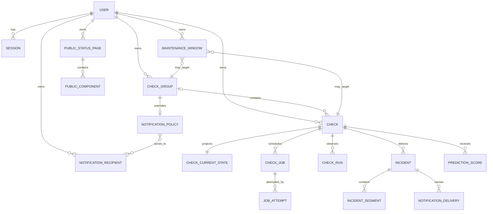

# Site Availability Monitor — Domain Modeli

**Sürüm:** 1.0  
**Durum:** Aşama 1 için nihai domain modeli  
**Tarih:** 2026-10-09 22:53 +06:00  
**Dayanak:** `REQUIREMENTS.md`, `DECISIONS.md`, `GLOSSARY.md`

## 1. Amaç ve Sınır

Bu belge ürünün iş alanını, aggregate sınırlarını, sahiplik kurallarını, komutları, olayları ve transaction sınırlarını tanımlar. Tablo, kolon, indeks veya ORM ayrıntısı içermez; bunlar Aşama 3 veritabanı mimarisinde bu modele göre belirlenecektir.

Domain modeli aşağıdaki ilkeleri korur:

- Kullanıcılar arasında kesin kaynak izolasyonu
- Check configuration ile yüksek frekanslı observation state'in ayrılması
- Ham run gözlemlerinin değiştirilemez olması
- State ve incident değişikliklerinin sıralı/idempotent uygulanması
- Monitoring boşluğunun hedef düşüşü sayılmaması
- Bildirim, public projection ve prediction'ın ana health kararından ayrılması
- Asenkron yan etkilerin kalıcı domain olaylarından beslenmesi

## 2. Domain Modülleri

### Identity

Kullanıcı kimliği, parola durumu, doğrulama ve session yaşam döngüsünü yönetir.

### Monitoring Configuration

Check ve group yapılandırmasını, sahipliği, config sürümlerini, pause/resume/delete ve manual-run komutlarını yönetir.

### Scheduling and Execution

Cadence, job, lease, attempt, fencing token ve immutable check run üretimini yönetir.

### Health and Incidents

Accepted observation'lardan current health, freshness, failure candidate, incident ve observed segment üretir.

### Maintenance

Check veya group kapsamındaki planlı bildirim bastırma aralıklarını yönetir.

### Notifications

Recipient, notification preference, intent ve delivery yaşam döngüsünü yönetir.

### History and Availability

Immutable run, health timeline, incident segment, rollup, availability ve coverage projection'larını üretir.

### Public Status

Sahibin açıkça seçtiği alanlardan girişsiz ve sınırlı public projection oluşturur.

### Prediction

Ana domain'i değiştirmeden feature snapshot ve süreli risk sonuçları üretir.

## 3. Kavramsal İlişki Modeli



Şema yalnızca kavramsaldır. Bir maintenance window aynı anda ya check ya group hedefler; iki hedefi birden kullanamaz.

## 4. Ortak Kimlik ve Değer Nesneleri

### Kimlikler

Bütün domain kimlikleri global olarak benzersiz, opaque ve public tahmine dirençli olmalıdır. Uygulama katmanı kimlikten owner çıkarımı yapmaz; sahiplik ayrıca doğrulanır.

### OwnerId

Her özel aggregate üzerinde zorunludur. Child entity'ler aggregate üzerinden owner devralır; cross-aggregate bağlantılarda owner eşitliği ayrıca korunur.

### Instant ve Duration

- Kalıcı zamanlar UTC instant'tır.
- Kullanıcının locale/timezone bilgisi yalnızca görüntüleme içindir.
- Süre ölçümünde mümkün olduğunda monotonic clock kullanılır; wall clock yalnızca olay zamanı için saklanır.
- Bakım aralığı `[starts_at, ends_at)` biçimindedir.

### ResourceVersion

Kullanıcının yaptığı her mutasyonda artar ve optimistic concurrency sağlar. Güncelleme komutu beklenen resource version'ı taşıyabilir; uyuşmazlık conflict üretir.

### ProbeGeneration

Aşağıdaki alanlar değiştiğinde artar:

- URL
- Timeout veya HTTP davranışı
- Beklenen status code
- Beklenen body metni
- Redirect/TLS gibi probe semantiği

Eski probe generation'a ait run state ve incident'a uygulanamaz.

### ScheduleGeneration

Aşağıdaki durumlarda artar:

- Interval değişimi
- Pause
- Resume
- Delete
- Cadence'i yeniden başlatan operasyon

Eski schedule generation'a ait queued işler iptal edilir veya state'e uygulanamaz.

### ConfigSnapshot

Job oluşturulduğunda probe için gerekli immutable alanların kopyası alınır. Worker çalışırken check düzenlense bile run'ın hangi koşullarla değerlendirildiği değişmez.

### FailureCategory

En az şu kararlı kategorilere sahiptir:

- `DNS_ERROR`
- `CONNECT_ERROR`
- `TLS_ERROR`
- `TIMEOUT`
- `TOO_MANY_REDIRECTS`
- `BLOCKED_TARGET`
- `RESPONSE_TOO_LARGE`
- `UNEXPECTED_STATUS`
- `BODY_MISMATCH`
- `PROTOCOL_ERROR`
- `UNKNOWN_NETWORK_ERROR`

Worker/internal programlama veya altyapı hataları hedef site failure'ı olarak sınıflandırılmaz.

## 5. Aggregate ve Entity'ler

### 5.1 User Aggregate

**Aggregate root:** `User`

**Sorumluluklar:**

- E-posta kimliğinin normalize edilmiş benzersizliğini korumak
- Parola credential durumunu yönetmek
- Hesap doğrulama ve devre dışı bırakma durumunu yönetmek
- Kullanıcının görüntüleme timezone/locale tercihini taşımak

**Temel durum:**

- `PENDING_VERIFICATION`
- `ACTIVE`
- `DISABLED`
- `DELETION_REQUESTED`

**Değişmezler:**

- Disabled veya deletion-requested hesap yeni session oluşturamaz.
- Disabled veya deletion-requested owner'a ait check'ler yeni scheduled job üretmez; public sayfalar etkisizleşir ve queued notification teslimatları gönderilmez.
- Parola hash'i domain olayına, loga veya API response'una girmez.
- Kullanıcı silme işlemi sahip olunan veriler için ayrı, denetlenebilir purge süreci başlatır.

`Session`, güvenlik nedeniyle User aggregate'ından bağımsız yüksek değişim hızlı bir entity/repository olarak yönetilir. Session iptali User kaydını kilitlemek zorunda değildir.

### 5.2 Check Group Aggregate

**Aggregate root:** `CheckGroup`

**Temel alanlar:**

- Kimlik ve owner
- Ad ve opsiyonel açıklama
- Notification policy bağlantısı
- Public görünüm için opsiyonel varsayılanlar
- Resource version
- Oluşturulma/güncellenme zamanı

**Değişmezler:**

- Grup ve bağlanan check aynı owner'a ait olmalıdır.
- Kullanıcı kapsamında grup adı için uniqueness ürün kararı değildir; aynı ada izin verilebilir.
- Grup silme check'leri silmez. Check'ler atomik olarak ungrouped olur.
- Grup silme yeni grup kapsamlı bakım veya bildirim üretimini durdurur.
- Mevcut notification delivery kayıtları silinmez.

Group health aggregate içinde yazılan bir gerçek değildir; check current-state verilerinden türetilen, yeniden oluşturulabilir projection'dır.

### 5.3 Check Aggregate

**Aggregate root:** `Check`

**Temel alan grupları:**

- Kimlik, owner ve opsiyonel group
- Görünen ad
- Probe configuration
- Schedule configuration
- Lifecycle: `LIVE` veya `DELETED`
- Execution: `ACTIVE` veya `PAUSED`
- Resource version
- Probe generation
- Schedule generation
- Cadence anchor ve `next_run_at`
- Oluşturulma, güncellenme ve opsiyonel silinme zamanı

**Değişmezler:**

- URL HTTP veya HTTPS olmalı ve güvenlik politikasını geçmelidir.
- Interval 30 saniye–1 saat aralığındadır.
- Timeout pozitif ve deployment güvenlik tavanının altındadır; interval'dan uzun olabilir.
- Beklenen status geçerli HTTP durum aralığındadır.
- Body expectation boyutu ve encoding politikasıyla sınırlandırılır.
- Deleted check yeni job veya manual-run üretemez.
- Bir check en fazla bir gruba aittir.

**Komutlar:**

- `CreateCheck`
- `ChangeDisplayMetadata`
- `ChangeProbeConfiguration`
- `ChangeScheduleInterval`
- `MoveCheckToGroup`
- `PauseCheck`
- `ResumeCheck`
- `RequestManualRun`
- `DeleteCheck`

**Komut semantiği:**

- Görünen ad değişimi yalnızca resource version'ı artırır.
- Group değişimi health'i sıfırlamaz; bakım/bildirim kapsamı bundan sonraki değerlendirmelerde yeni gruptan alınır.
- Probe configuration değişimi probe generation'ı artırır, eski queued işleri geçersiz kılar, failure candidate'ı temizler ve effective health'i yeni geçerli gözleme kadar UNKNOWN yapar.
- Probe configuration değiştiğinde açık incident `CONFIG_CHANGED` nedeni ile kapanır; daha önce DOWN almış recipient'lar için “doğrulanmış recovery değil, izleme tanımı değişti” anlamlı kapanış olayı üretilir.
- Interval değişimi schedule generation'ı artırır ve yeni cadence'i değişiklik anından başlatır; health'i sıfırlamaz. Mevcut accepted observation'ın `fresh_until` değeri yeni interval'e göre tekrar hesaplanır.
- Pause schedule generation'ı artırır, queued işleri iptal eder ve çalışan işin sonucunu state için geçersiz kılar. Son bilinen health korunur fakat effective health stale/UNKNOWN olur.
- Resume schedule generation'ı artırır, check'i ACTIVE yapar ve ilk otomatik çalışmayı mümkün olan en kısa zamana planlar. Yeni sonuç gelene kadar effective health UNKNOWN'dır.
- Delete terminaldir: check hemen özel/public sorgulardan çıkar, schedule durur, queued işler iptal edilir, çalışan sonuçlar reddedilir ve açık incident `CHECK_DELETED` ile kapanır. Fiziksel purge retention/privacy politikasına göre asenkron olabilir.

### 5.4 Check Current State Projection/Aggregate

`CheckCurrentState`, dashboard için hızlı okunan ve observation acceptance sırasında transaction içinde kilitlenen tekil state kaydıdır.

**Temel alanlar:**

- Check ve owner kimliği
- Last observed health
- Effective health için freshness verisi
- Consecutive failure count
- Failure candidate başlangıcı ve ilk run kimliği
- Açık incident kimliği
- Son accepted run/fencing token
- Son başarılı ve son başarısız run zamanları
- Son response time, status ve failure category
- `fresh_until`
- State version

**Değişmezler:**

- Yalnızca accepted observation state'i değiştirebilir.
- Fencing token monoton artar; düşük/eşit stale token tekrar uygulanmaz.
- Probe/schedule generation uyuşmayan run state'i değiştiremez.
- Aynı accepted run ikinci kez uygulandığında sonuç değişmez.
- Projection ham run geçmişinin yerine geçmez ve gerektiğinde yeniden oluşturulabilir.

### 5.5 Check Job Aggregate

**Aggregate root:** `CheckJob`

**Amaç:** Planlanmış veya manuel bir kontrol niyetini kalıcı ve sahiplenilebilir hale getirmek.

**Temel alanlar:**

- Check ve owner
- Trigger: `SCHEDULED` veya `MANUAL`
- Manual mode: `STATEFUL` veya `DIAGNOSTIC`
- `scheduled_for`
- Config snapshot
- Probe ve schedule generation
- Job state
- Attempt count
- Lease owner, lease expiry ve heartbeat
- Fencing token

**Değişmezler:**

- Check başına queued/running iş kombinasyonu domain kuralıyla tekilleştirilir.
- Tekrarlanan manual request en fazla bir pending manual intent'e birleşir.
- ACTIVE check'te manual run `STATEFUL`; PAUSED check'te `DIAGNOSTIC` olur.
- Diagnostic run health, incident, availability ve normal bildirimi değiştirmez.
- Hedef failure'ı job failure değildir; worker hedefe ulaşıp sonucu sınıflandırdıysa job `COMPLETED` olur.
- Internal worker failure gözlem üretmeden retry edilebilir.

### 5.6 Job Attempt Entity

Her lease alımı bir attempt'tir. Attempt; worker kimliği, fencing token, başlangıç, heartbeat, bitiş ve terminal nedeni taşır.

Attempt geçmişi:

- Operasyonel hata ayıklama içindir.
- Check availability'yi doğrudan etkilemez.
- Lease kaybetmiş attempt'in geç sonucu run olarak saklanabilir fakat accepted observation olamaz.

### 5.7 Check Run Entity

`CheckRun` immutable observation'dır; oluşturulduktan sonra iş sonucu değiştirilemez.

**Temel alanlar:**

- Owner, check, job ve attempt kimliği
- Trigger ve manual mode
- Probe/schedule generation ve fencing token
- Scheduled, started ve finished zamanları
- Monotonic duration ölçümleri
- DNS/connect/TLS/TTFB/total timing değerleri — desteklendiği ölçüde
- HTTP status
- Body-match sonucu
- `PASS` veya `FAIL`
- Failure category ve sanitize edilmiş kısa tanı
- `accepted_for_state` ve reddedilme nedeni

**Değişmezler:**

- Ham response body saklanmaz.
- İç hata hedef FAIL gözlemi olarak uydurulmaz.
- Sonuç sonradan PASS/FAIL arasında değiştirilemez.
- Redacted tanı gizli query, credential veya response body içeremez.

### 5.8 Failure Candidate

Failure candidate ayrı bir aggregate root değildir; CheckCurrentState içindeki provisional health bilgisidir.

İlk accepted FAIL:

- Health `SUSPECT` olur.
- Candidate başlangıcı ve ilk run kaydedilir.
- Incident veya DOWN bildirimi oluşmaz.

Sonraki accepted sonuç:

- FAIL ise candidate doğrulanır, incident açılır ve ilk failure zamanı incident başlangıcı olur.
- PASS ise candidate kaldırılır; provisional süre doğrulanmış downtime sayılmaz.
- Data gap, pause, probe change veya delete candidate'ı doğrulamadan temizler.

### 5.9 Incident Aggregate

**Aggregate root:** `Incident`

**Temel alanlar:**

- Owner ve check
- İlk failure run
- Confirmation run ve zamanı
- `started_at`
- Status: `OPEN` veya `CLOSED`
- Observation mode: `OBSERVED` veya `UNOBSERVED`
- Closure time ve closure reason
- Observed duration toplamı
- Wall-clock span — türetilmiş
- Son failure category
- Notification summary projection

**Closure reason:**

- `RECOVERED`
- `CONFIG_CHANGED`
- `CHECK_DELETED`

Pause veya monitoring gap incident'ı kapatmaz; aktif observed segment'i sonlandırır ve incident'ı `UNOBSERVED` hale getirir. Böylece daha sonra gelen ilk başarı gerçek recovery olarak aynı incident'ı kapatabilir, fakat gözlemsiz süre downtime duration'a eklenmez.

**Değişmezler:**

- Bir check'in en fazla bir açık incident'ı vardır.
- Incident yalnızca threshold geçildiğinde oluşturulur.
- `started_at`, ilk failure candidate zamanıdır.
- `confirmed_at`, threshold'u geçen run zamanıdır.
- Observed duration yalnızca incident segmentlerinin toplamıdır.
- Closed incident tekrar açılamaz; gerekirse yeni incident oluşturulur.
- Aynı event tekrar uygulandığında yeni incident veya segment oluşmaz.

### 5.10 Incident Segment Entity

Incident'ın gerçekten DOWN olarak gözlemlendiği `[segment_start, segment_end)` zaman aralığıdır.

- İlk segment candidate başlangıcında başlar.
- Freshness STALE, pause veya probe generation değişimi segment'i sonlandırır.
- Açık incident varken accepted FAIL gelirse yeni segment başlayabilir.
- Accepted PASS aktif segment'i ve incident'ı kapatır.
- Aynı incident segmentleri örtüşemez.

Kullanıcıya gösterilen “doğrulanmış düşüş süresi” segment toplamıdır. Wall-clock span ayrıca gösterilecekse data gap bulunduğu açıkça belirtilir.

### 5.11 Maintenance Window Aggregate

**Aggregate root:** `MaintenanceWindow`

**Temel alanlar:**

- Owner
- Hedef türü: `CHECK` veya `GROUP`
- Hedef kimliği
- Ad/açıklama
- `starts_at` ve `ends_at`
- Lifecycle: `SCHEDULED`, `CANCELLED`; `ACTIVE/ENDED` zamanla türetilir
- Resource version

**Değişmezler:**

- Hedef ve maintenance aynı owner'a aittir.
- `starts_at < ends_at` olmalıdır.
- Aralık `[starts_at, ends_at)` biçimindedir.
- Check için doğrudan ve grup üzerinden etkin pencereler birleşimdir.
- Maintenance health veya run üretimini değiştirmez; yalnızca notification eligibility ve UI projection'ını etkiler.

Aktif bakım düzenlenebilir veya iptal edilebilir. Her değişiklik reconciliation olayı üretir; açık incident ve bekleyen notification intent'leri güncel gerçeklere göre yeniden değerlendirilir.

### 5.12 Notification Recipient ve Policy

`NotificationRecipient` kullanıcıya ait e-posta hedefidir.

**Recipient state:**

- `PENDING_VERIFICATION`
- `VERIFIED`
- `DISABLED`

Yalnızca VERIFIED recipient operasyonel teslimat alabilir.

`NotificationPolicy` iki seviyededir:

- Kullanıcı varsayılanı
- Grup override veya varsayılanı devralma

Check group taşımı, henüz gönderilmemiş DOWN için gönderim anındaki policy'yi etkiler. Daha önce DOWN gönderilmiş recipient'lar recovery/closure eşlemesinin kaynağıdır.

### 5.13 Outbox Event

Outbox event domain değişikliğiyle aynı transaction'da yazılan immutable mesajdır.

**Event envelope:**

- Event ID
- Event type ve schema version
- Owner ID
- Aggregate type, ID ve version
- Occurred at
- Correlation ID
- Opsiyonel causation ID
- Minimal ve redacted payload

Event consumer'ları event ID üzerinden idempotent olmalıdır. Payload yeniden yetkilendirme veya kalıcı state yerine geçmez; consumer gerektiğinde source of truth'u tekrar okur.

### 5.14 Notification Intent ve Delivery

`NotificationIntent`, incident olayı için politika değerlendirme kaydıdır. `NotificationDelivery` tek recipient ve tek event türü içindir.

**Intent örnekleri:**

- Incident opened/down
- Incident recovered
- Incident administratively closed/config changed
- Predictive warning

**Delivery identity:**

`incident + event kind + recipient` benzersiz iş anahtarıdır.

DOWN gönderimi anında geçerli bakım ve recipient policy tekrar okunur. RECOVERY veya closure teslimatı yalnızca daha önce başarılı DOWN teslimatı bulunan recipient'a üretilir.

### 5.15 Public Status Page Aggregate

**Aggregate root:** `PublicStatusPage`

**Temel alanlar:**

- Owner
- Görünen başlık/açıklama
- Lifecycle: `DRAFT`, `PUBLISHED`, `DISABLED`
- Slug/token digest ve revision
- Seçili component'ler
- Alan görünürlük politikası
- Resource version

**Değişmezler:**

- Component ve page aynı owner'a aittir.
- Disabled/draft page public veri döndürmez.
- Slug rotation eski bağlantıyı geçersiz kılar.
- Varsayılan olarak gerçek URL ve özel ayrıntılar yayınlanmaz.
- Public projection yalnızca allowlist alanlardan oluşturulur; private DTO filtrelenerek public DTO yapılmaz.

### 5.16 Prediction Score ve Analysis Job

`AnalysisJob`, check başına en güncel analiz ihtiyacını temsil eder ve eski talepler birleştirilebilir.

`PredictionScore` immutable, advisory sonuçtur:

- Owner ve check
- Hesaplama zamanı
- Prediction horizon
- Score ve risk seviyesi
- `valid_until`
- Model/algorithm version
- Feature snapshot/version
- Redacted açıklama nedenleri

Prediction state'i main health state'e referans olabilir fakat onu değiştiremez. Süresi geçmiş prediction etkili sonuç değildir.

### 5.17 Audit Event

Hassas kullanıcı ve sistem mutasyonlarını append-only kaydeder:

- Kim, ne zaman, hangi kaynak üzerinde işlem yaptı
- İşlem türü ve sonucu
- Correlation/request ID
- Güvenli, redacted değişiklik özeti

Audit event parola, session token, body içeriği veya gizli URL parametresi içermez.

## 6. Komut Davranışları ve Edge Case'ler

### Create Check

- Check ACTIVE oluşturulur.
- Health için henüz veri olmadığından effective health UNKNOWN ve freshness STALE'dır.
- İlk scheduled job mümkün olan en kısa zamana jitter ile planlanır.

### Pause Check

- Yeni scheduled job üretilmez.
- Queued scheduled job'lar iptal edilir.
- Running attempt'in iptali istenir; geç sonucu state için reddedilir.
- Failure candidate temizlenir.
- Açık incident'ın aktif segment'i pause anında kapanır; incident unobserved kalır.
- Son observed health tanısal olarak korunur; effective health UNKNOWN/STALE gösterilir.

### Resume Check

- Check ACTIVE olur ve yeni schedule generation alır.
- İlk job hemen/çok kısa jitter ile planlanır.
- İlk kabul edilmiş sonuca kadar effective health UNKNOWN'dır.
- Önceden açık incident varsa ilk FAIL yeni observed segment başlatır; ilk PASS incident'ı RECOVERED olarak kapatır.

### Manual Run

- Check ACTIVE ise stateful çalışır ve scheduled run ile aynı state machine'e katılır.
- Check PAUSED ise diagnostic çalışır; sonucu geçmişte ayrı işaretlenir fakat health, incident, availability veya normal notification değiştirmez.
- Manual run cadence'i kaydırmaz.
- Active job varsa en fazla bir pending manual intent tutulur.

### Probe Configuration Change

- Probe generation artar.
- Eski queued/running sonuçlar state için geçersiz olur.
- Candidate temizlenir ve effective health UNKNOWN olur.
- Açık incident CONFIG_CHANGED ile kapanır; observed segment değişiklik anında biter.
- Yeni config için mümkün olan en kısa zamanda check planlanır.

### Schedule Interval Change

- Schedule generation artar.
- Yeni cadence anchor değişiklik anıdır.
- `next_run_at = changed_at + new_interval` olur.
- Mevcut health ve incident korunur.
- `fresh_until`, son accepted run zamanı + yeni interval + timeout/grace olarak yeniden hesaplanır; sonuç geçmişte kalıyorsa state hemen STALE olur.

### Move Check to Group

- Health ve incident değişmez.
- Yeni maintenance ve notification değerlendirmeleri yeni gruba göre yapılır.
- Önceden DOWN teslimatı alan recipient'lar recovery eşlemesi için korunur.

### Delete Check

- Kaynak kullanıcı ve public sorgulardan hemen kaybolur.
- Schedule durur; queued işler iptal edilir ve running sonuç reddedilir.
- Candidate temizlenir.
- Açık incident CHECK_DELETED ile kapanır.
- Bekleyen normal notification intent/delivery'ler iptal edilir.
- Ham geçmiş ve audit verisinin fiziksel purge zamanı retention/privacy politikasına tabidir.

### Delete Group

- Check'ler silinmez; ungrouped olur.
- Grup maintenance ve notification policy yeni işlemler için geçersiz olur.
- Public group component kaldırılır veya sayfa revision'ı ile etkisizleşir.
- Gönderilmiş DOWN delivery kayıtları recovery eşlemesi için korunur.

## 7. Observation Acceptance İşlemi

Bir run tamamlandığında tek transaction içinde şu sıra uygulanır:

1. Job/attempt kimliği ve idempotency doğrulanır.
2. Immutable CheckRun eklenir veya aynı run daha önce kaydedilmişse mevcut kayıt alınır.
3. Check ve CheckCurrentState kilitlenir.
4. Lifecycle, generation, fencing token ve manual mode değerlendirilir.
5. Run'ın `accepted_for_state` kararı ve reddedilme nedeni kesinleştirilir.
6. Kabul edilmediyse transaction yalnızca tanısal run ve job terminal durumunu yazar.
7. Kabul edildiyse freshness ve health state machine çalıştırılır.
8. Gerekirse incident/segment oluşturulur veya kapatılır.
9. Availability timeline/projection için domain değişikliği kaydedilir.
10. Gerekli outbox event'leri aynı transaction'da eklenir.
11. Job terminal duruma geçirilir ve transaction commit edilir.

Bu transaction SMTP göndermez, SSE bağlantısına yazmaz veya predictor çağırmaz.

## 8. Transaction Sınırları

### Configuration transaction

Check/group değişikliği, generation/version artışı, job invalidation, state reset ve ilgili outbox olayı birlikte commit edilir.

### Observation transaction

Run, current state, incident segment, incident ve outbox değişiklikleri birlikte commit edilir.

### Maintenance transaction

Maintenance değişikliği ve reconciliation talebi birlikte commit edilir. Bütün incident'ları aynı kullanıcı transaction'ında güncellemek zorunlu değildir.

### Notification transaction

Intent değerlendirmesi ve delivery oluşturma idempotent transaction'dır. SMTP çağrısı transaction dışında yapılır; sonuç ayrı transaction ile kaydedilir.

### Public page transaction

Page/component/görünürlük değişikliği ve page revision artışı birlikte commit edilir.

### Prediction transaction

Analysis job terminal durumu ve yeni prediction score birlikte commit edilebilir; ana monitoring tabloları yazılamaz.

## 9. Türetilen Projection'lar

Aşağıdakiler source of truth değil, yeniden oluşturulabilir okuma modelleridir:

- Dashboard check current state
- Group current health
- Gün/hafta/ay response-time rollup
- Availability ve coverage bucket'ları
- Incident notification summary
- Public status snapshot
- Latest valid prediction

Projection gecikmesi domain gerçeğini değiştirmez. API gerektiğinde `as_of`/`updated_at` bilgisi döndürerek kullanıcının verinin yaşını anlamasını sağlar.

## 10. Group Health Türetimi

Yalnızca lifecycle LIVE ve execution ACTIVE check'ler grup health hesabına girer.

Öncelik:

```text
DOWN > SUSPECT > UNKNOWN > UP
```

Kurallar:

- Freshness STALE check'in effective health'i UNKNOWN'dır.
- En az bir DOWN varsa grup DOWN'dır.
- DOWN yok ve en az bir SUSPECT varsa grup SUSPECT'tir.
- DOWN/SUSPECT yok ve en az bir UNKNOWN varsa grup UNKNOWN'dır.
- Bütün dahil edilen check'ler UP ise grup UP'dır.
- Grupta aktif check yok fakat paused check varsa execution özeti PAUSED, health özeti UNKNOWN'dır.
- Grup boşsa health UNKNOWN ve `empty=true` döner.

Bakım özeti health'ten ayrıdır ve `NONE`, `PARTIAL` veya `FULL` olarak türetilebilir.

## 11. Zaman Çizelgesi ve Data Gap

Her accepted stateful run yeni bir `fresh_until` üretir. Değer, bir sonraki beklenen cadence, o job için geçerli timeout ve scheduler grace dikkate alınarak belirlenir.

`fresh_until` geçtiğinde ve daha yeni accepted run yoksa:

1. Freshness STALE olur.
2. Effective health UNKNOWN olur; last observed health korunur.
3. Failure candidate temizlenir.
4. Açık incident'ın aktif observed segment'i `fresh_until` zamanında kapanır.
5. Incident açık fakat UNOBSERVED durumda kalabilir.
6. Availability timeline `fresh_until` sonrasında UNKNOWN üretir.

Yeni accepted run geldiğinde:

- PASS ise açık incident RECOVERED olarak kapanır; gap DOWN süresine eklenmez.
- FAIL ve açık incident varsa yeni observed DOWN segment'i başlar.
- FAIL ve açık incident yoksa yeni failure candidate başlar.

## 12. Domain Event Kataloğu

İlk event ailesi:

### Configuration

- `user.created`
- `user.disabled`
- `check.created`
- `check.metadata_changed`
- `check.probe_configuration_changed`
- `check.schedule_changed`
- `check.paused`
- `check.resumed`
- `check.group_changed`
- `check.deleted`
- `group.created`
- `group.changed`
- `group.deleted`

### Execution and health

- `check.manual_run_requested`
- `check.job_available`
- `check.run_recorded`
- `check.observation_accepted`
- `check.observation_rejected`
- `check.health_changed`
- `check.freshness_changed`
- `incident.opened`
- `incident.observation_suspended`
- `incident.observation_resumed`
- `incident.closed`

### Maintenance and notification

- `maintenance.created`
- `maintenance.changed`
- `maintenance.cancelled`
- `maintenance.reconciliation_requested`
- `notification.intent_created`
- `notification.delivery_scheduled`
- `notification.delivery_sent`
- `notification.delivery_failed`

### Public and prediction

- `public_page.published`
- `public_page.changed`
- `public_page.disabled`
- `prediction.requested`
- `prediction.updated`
- `prediction.expired`

Event adları implementasyon öncesinde event sözleşmesi belgesinde version'lanacaktır. Bu katalog domain kapsamını sabitler, payload şemasını değil.

## 13. Domain Katmanında Olmayan Sorumluluklar

- HTTP framework ve route ayrıntıları
- SQL tablo/indeks isimleri
- SMTP provider ayrıntısı
- SSE connection yönetimi
- Grafik kova çözünürlüğü
- Python kütüphanesi veya model algoritması
- Container/orchestrator yapılandırması

Bu ayrıntılar domain kurallarını çağırır fakat değiştiremez.

## 14. Domain Modeli Tamamlanma Kontrolü

- Her özel aggregate owner taşır.
- Check config, job, run, current state ve incident birbirinden ayrılmıştır.
- Manual, pause, resume, edit, group move ve delete davranışları tanımlıdır.
- Stale run ve lease kaybının state'i bozması engellenmiştir.
- Data gap, incident duration ve availability ilişkisi tanımlıdır.
- Maintenance, notification ve public projection ana health gerçeğinden ayrıdır.
- Predictor ana domain üzerinde yazma yetkisine sahip değildir.
- Kritik mutasyonların transaction ve event sınırları tanımlıdır.

