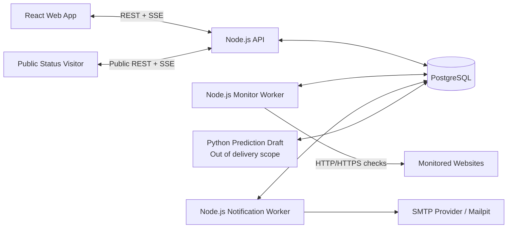

# Site Availability Monitor — Final Architecture (v1.2)

**Status:** Architecture foundation aligned with Stage 1 domain decisions  
**Date:** 2026-10-09 22:58 +06:00  
**Scope:** Initial deliverable release and subsequent scaling direction

## 1. Architectural Summary

The product is a modular monolith consisting of a separate React frontend, Node.js backend processes, and a PostgreSQL database. The isolated Python predictor draft from the prior research round is not part of the delivery scope and is not a dependency of the main runtime in any way.

Operation of the main product depends exclusively on the Node.js and PostgreSQL components. The Python prediction system has been removed from the delivery scope; the prediction sections in this document merely record the prior research direction and do not constitute completed product behavior.

The system is genuinely multi-user. Each user can access only their own resources. Organizations, team memberships, invitations, and role management are out of scope for the initial release.

There is no fixed product limit such as 50 checks. The scheduler and worker processes operate on the exact same data model in small or large installations; capacity is scaled via worker count and concurrency settings.

### 1.1 Architectural Invariants

- PostgreSQL is the durable source of truth; process memory is not considered durable work or domain state.
- The main product has no synchronous calls or startup dependencies on the predictor.
- A check result is durably written first; current state can only be advanced by a valid config version and the latest fencing token.
- Missed schedule ticks are not backfilled and are not interpreted as target downtime.
- Execution, health, maintenance, and freshness are distinct state axes.
- Availability is time-weighted; unknown duration is separately reported as coverage.
- A domain change and its associated outbox event are written within the same transaction.
- There is no fixed product limit; quota and concurrency limits configured by deployment exist for resource protection.
- All durable domain timestamps are stored in UTC.

## 2. Key Decisions

| Area | Decision |
| --- | --- |
| Architectural form | Modular monolith with distinct processes |
| Frontend | React + TypeScript + Vite |
| Backend | Node.js + TypeScript + Fastify |
| Database | PostgreSQL |
| SQL access | Typed repository layer; Kysely preferred |
| API | REST + OpenAPI |
| Live updates | Server-Sent Events (SSE) |
| Job queue | PostgreSQL-backed durable jobs and lease mechanism |
| Scheduler correctness | Fixed cadence, heartbeat, fencing token, and stale-result rejection |
| Email | Node.js notification worker + transactional outbox + SMTP adapter |
| Local email | Mailpit |
| Prediction | Out of delivery scope; isolated research draft |
| User model | Email/password account and user-based ownership |
| Session | Secure HTTP-only cookie session |
| Availability | Time-weighted state duration + separate data coverage |
| Local execution | Docker Compose |
| Redis | Not used in initial release |
| Microservices | Not used in initial release |

The goal of these choices is to provide process isolation, resilience, and horizontal scaling without introducing unnecessary distributed systems complexity.

## 3. System Context



PostgreSQL is the system's durable source of truth. `LISTEN/NOTIFY` is used solely to notify processes of new data; it is not used as a durable event or state store.

## 4. Runtime Processes

### 4.1 Web

The React application provides the following views/screens:

- Login and account management
- Check list and check editing
- Group management
- Current status dashboard
- Check detail and history charts
- Incident log
- Maintenance windows
- Notification recipients and preferences
- Public status page configuration
- Optional early warning / risk view

Server data is managed via a query-cache layer similar to TanStack Query. SSE carries only update signals and lightweight state events; when the connection is re-established, the accurate state is fetched from a REST snapshot.

### 4.2 API

The API process has the following responsibilities:

- Authentication and session management
- User ownership and authorization
- CRUD operations
- Manual check requests
- History and incident queries
- Secure projection of public page data
- SSE connections
- OpenAPI contract

The API executes neither site checks nor email dispatches within the request lifecycle.

### 4.3 Monitor Worker

The monitor worker executes the following:

- Claiming due checks
- Performing HTTP/HTTPS requests
- Timeout, expected status code, and response body string verification
- Storing raw check results
- Updating current state and consecutive failure counts
- Opening or closing incidents
- Determining next run time
- Generating associated domain/outbox events within a transaction

Multiple monitor workers can run concurrently.

### 4.4 Notification Worker

The notification worker:

- Claims durable notification jobs.
- Applies maintenance window rules.
- Resolves group or user default recipients.
- Renders HTML and plain-text emails.
- Dispatches emails via the SMTP adapter.
- Manages retry, backoff, idempotency, and terminal failure states.

When the email provider is unreachable, the primary monitoring flow remains unaffected.

### 4.5 Python Prediction Worker

The prediction worker operates strictly as an auxiliary feature:

- Reads rollup/feature data within a bounded time window.
- Performs statistical anomaly and trend analysis.
- Generates risk scores and explanations.
- Writes results solely to its dedicated prediction tables.

The prediction worker cannot:

- Schedule or execute checks
- Alter main check state
- Open or close incidents
- Generate regular `DOWN`/`RECOVERY` notifications
- Block the API or other workers from starting

## 5. User and Ownership Isolation

Every domain resource belongs directly to a user. There is no organization or collaboration model in the initial release.

Fundamental principles:

- `owner_id` is never trusted from the client request body; it is always derived from the session.
- Every user query is scoped to the authenticated user.
- Even if a resource ID is known, records belonging to another user cannot be read or modified.
- Composite foreign keys or equivalent database constraints prevent resources with different owners from referencing each other.
- Public endpoints do not use management DTOs; they return only explicitly published fields.
- PostgreSQL Row-Level Security (RLS) is implemented as a defense-in-depth layer on user-owned tables.
- The API, monitor worker, notification worker, and predictor use separate, least-privilege database roles.

An API request establishes a transaction-scoped user context (e.g., via `SET LOCAL`) within the database transaction. This prevents pooled connections from leaking a prior user's context to another request. The API role does not hold RLS bypass privileges. Worker roles have access only to the tables and operations necessary for their specific tasks.

In large, partitioned time-series tables, the owner ID is stored directly. Composite keys such as `(resource_id, owner_id)` or equivalent constraints prevent cross-linking resources belonging to different users at the database level. RLS is not treated as a standalone authorization system; API policy checks, database constraints, and negative integration tests are used in conjunction.

For authentication:

- Passwords are stored using a modern, robust hashing algorithm such as Argon2id.
- Session cookies use `HttpOnly`, `Secure`, and appropriate `SameSite` configurations.
- Session rotation, logout, and expiration are supported.
- State-changing endpoints are protected with a CSRF mitigation strategy.
- Rate limiting is applied to login and sensitive endpoints.

## 6. Core Data Model

Table names may vary slightly during implementation; ownership and responsibility boundaries must remain unchanged.

### Identity and configuration

- `users`
- `sessions`
- `check_groups`
- `checks`
- `notification_recipients`
- `notification_preferences`
- `public_status_pages`
- `public_status_components`
- `audit_events`

A check belongs to zero or one group. This design avoids ambiguity in group status, maintenance, and recipient rules. If a group is deleted, checks are either unassigned from the group with user confirmation or deleted alongside it; the exact behavior is explicitly specified in the API contract.

### Execution state and history

- `check_current_states`
- `check_jobs`
- `check_runs`
- `check_rollups`
- `incidents`
- `maintenance_windows`
- `maintenance_targets`
- `system_tasks`

### Events and email

- `outbox_events`
- `notification_deliveries`

### Prediction

- `analysis_jobs`
- `prediction_scores`
- `prediction_model_versions`

Even if prediction tables are empty or the predictor is completely disabled, the behavior of all other tables remains unchanged.

`resource_version` is maintained for general optimistic concurrency, while `probe_generation` (for fields affecting probe semantics) and `schedule_generation` (for fields affecting scheduling semantics) are tracked separately. Job and run records carry the generation values and config snapshot at the time the execution started. Current-state rows store the latest accepted fencing token/sequence value. This ensures that even if a delayed or replayed result is recorded in history as diagnostic data, it cannot regress the current health state.

## 7. Scheduler and Check Execution

Each active check has at least the following fields:

- URL
- Check interval: 30 seconds – 1 hour
- Timeout
- Expected HTTP status code
- Optional expected response body text
- `next_run_at`
- Active / paused status

The scheduler fetches only due checks in small batches using indexed queries. Checks are never loaded entirely into memory.

The claiming mechanism uses PostgreSQL transactions, `FOR UPDATE SKIP LOCKED`, time-bounded leases, heartbeats, and monotonic fencing tokens. A database constraint deduplicates queued/running jobs for the same check. The lease duration is chosen to be longer than the check timeout plus a safety margin; workers renew leases periodically.

Periodic scheduling uses a fixed cadence. `next_run_at` is advanced along the scheduled timeline to the earliest valid point after the current time. Backlogged jobs are not produced for missed ticks. Manual runs do not alter the periodic cadence.

Core flow:

1. The scheduler atomically claims a due check.
2. A new fencing token and current config snapshot/version are recorded for the job.
3. A `check_jobs` record is created, and `next_run_at` is advanced to the next future cadence slot.
4. The worker executes the request bounded by timeout and response-size limits; it attempts to abort the request if the lease is lost.
5. The result is written to `check_runs` as diagnostic truth.
6. The current-state row is locked; the result is applied to state/incident only if it matches the current config version and bears the latest fencing token.
7. Current state, incident, and necessary outbox events are updated within the same transaction.
8. The lease is transitioned to the completed state.

While a check is already in-flight, a new periodic job is not started. If a manual execution request is received, it is coalesced into at most one pending manual job and executed once the ongoing run completes. A manual run on an ACTIVE check is stateful; a manual run on a PAUSED check is recorded diagnostically and does not mutate health/incident/availability or trigger notifications. Mathematical exactly-once HTTP requests to an external target cannot be guaranteed; the guaranteed behavior is single-active execution under normal conditions, and the acceptance of only a single, latest-fencing-token result into domain state.

Time windows missed while workers or the server are down are not executed retroactively and are not recorded as failures. Following a restart, checks resume from the current time. In history charts, this interval appears as a data gap.

Controlled jitter is applied to execution times to prevent thundering herds during initial setup or mass restarts.

During graceful shutdown, workers stop accepting new jobs, attempt to complete active requests within a defined drain period, and leave uncompleted jobs safely reclaimable. Stale lease reclamation is an idempotent housekeeping task.

## 8. Capacity and Horizontal Scaling

There is no hard-coded application limit on the number of checks. The system uses the exact same mechanism for 20, 200, or 500 checks.

The absence of a fixed product limit does not imply unrestricted resource consumption. Active check quotas, manual-run rate limits, global and per-user concurrency, per-hostname concurrency, timeouts, response size limits, and SSE connection limits are configured according to deployment capacity. These values are not hardcoded to fixed numbers like 50 in domain logic.

Approximate required concurrency is estimated as follows:

```text
required concurrency ≈ checks per second × p95 request duration
```

If all 500 checks execute at a 30-second interval, the average dispatch rate is approximately 16.7 requests/second. Actual capacity is measured based on timeouts, target latencies, and error distributions.

Resource protection:

- Worker concurrency is configurable.
- Worker replica counts can be scaled horizontally.
- Fair-share scheduling is enforced per user; a single user cannot monopolize the entire queue.
- Concurrency limits are applied per target hostname.
- Open connections, response body size, and total timeout are bounded.
- Under queue pressure, new manual jobs are rate-limited in a controlled manner.
- Queue lag, active jobs, and timeout ratios are monitored as metrics.

50 checks is not a product boundary, but one of the performance testing profiles. Load tests must cover at least 20, 200, and 500 check scenarios.

## 9. Check Status and Incident State Machine

Check status is tracked across four orthogonal axes rather than a single enum:

```text
execution:   ACTIVE | PAUSED
health:      UNKNOWN | UP | SUSPECT | DOWN
maintenance: true | false
freshness:   FRESH | STALE
```

- `UNKNOWN`: No valid result exists yet, or the current result has exceeded the trustworthy freshness threshold.
- `UP`: The latest verified health state is successful.
- `SUSPECT`: An initial failure has been observed, but the outage threshold has not been exceeded.
- `DOWN`: The consecutive failure threshold has been exceeded and an incident has been opened.
- `PAUSED`: Execution axis only; the last health status may be preserved as historical fact.

Maintenance does not replace health status. For example, a check can simultaneously be `ACTIVE`, `DOWN`, `under_maintenance=true`, and `FRESH`. The freshness threshold is derived from interval and scheduler tolerance. Following an unpause, visible health is treated as `UNKNOWN/STALE` until a new valid result arrives.

The initial threshold is two consecutive failures:

- The first failure is written to raw history and the health state becomes `SUSPECT`.
- Upon the second consecutive failure, the incident becomes visible.
- The incident's `started_at` timestamp is the time of the first failed observation.
- The first successful check closes the incident.
- Subsequent failed checks belong to the same open incident.

An incident may consist of genuinely observed DOWN segments. When freshness becomes STALE or the check is PAUSED, the active segment closes; the incident remains open but becomes `UNOBSERVED`. A subsequent FAIL starts a new segment within the same incident, while a subsequent PASS closes the incident with recovery. UNKNOWN / data-gap duration is never added to the incident's observed duration.

The threshold may be made configurable per check in the future; in the initial release it can remain a system default.

Group status is derived from the worst active state of its member checks. Precedence of `DOWN`, `SUSPECT`, `UNKNOWN`, `UP` is applied; if all checks are paused, the group is displayed as `PAUSED`.

## 10. Maintenance Windows

A maintenance window can be applied to a single check or a group. The initial release supports one-off windows with designated start and end times. All timestamps are stored in UTC, and windows are evaluated as `[starts_at, ends_at)`. Overlapping windows form a union; notification suppression persists while any window is active. Recurring maintenance rules can be added as a separate enhancement.

During maintenance:

- Checks run as normal.
- Results and charts continue to update.
- Status and incidents are computed.
- The UI displays the true status alongside a maintenance badge.
- Normal notifications are suppressed.

Behavioral rules:

- If an incident starts during maintenance and resolves during maintenance, no email is sent.
- If an incident starts during maintenance and remains open at the end of the window, a `DOWN` notification is generated immediately upon window expiry.
- If a `DOWN` notification was sent prior to maintenance and recovery occurs during maintenance, the recovery notification is deferred until the maintenance window concludes.
- The notification worker re-validates maintenance status immediately prior to dispatching via SMTP.
- Deferred deliveries carry a `not_before` timestamp, but at send time the current incident, maintenance, and prior delivery state are re-evaluated.
- Extending, shortening, deleting active maintenance, or reassigning a check's group is idempotently re-evaluated by a reconciliation job.

## 11. Email Architecture

Regular notification events:

- `INCIDENT_OPENED`
- `INCIDENT_RECOVERED`

Optional predictive event:

- `PREDICTIVE_WARNING`

The incident update and outbox event are written within the same PostgreSQL transaction. The notification worker translates durable events into delivery records.

Recipient model:

- The user may define default verified recipients.
- Each group can specify its own recipient list or inherit user defaults.
- New recipients cannot receive operational alerts until verified.
- Prediction alerts can be enabled/disabled independently of standard incident alerts.

For deduplication, `incident_id + event_type + recipient` is unique. Continuously failing checks do not produce duplicate emails.

Delivery states include at least `pending`, `processing`, `sent`, `retry`, `failed`, and `cancelled`. Exponential backoff and jitter are applied upon failure.

If an incident resolves before the `DOWN` email is dispatched, the pending `DOWN` is cancelled and no `RECOVERY` is sent. If the `DOWN` has already been dispatched, recovery is sent to the same recipients.

Recipients for a DOWN delivery are resolved from active group/user preferences at the time of dispatch. RECOVERY is sent strictly to the recipient records that previously received a successful DOWN delivery for that incident; this prevents configuration changes from misrouting resolution notices.

Mailpit is used for local development; standard SMTP or another provider via an adapter is used in production. Because SMTP cannot provide mathematical exactly-once guarantees, the system uses a single delivery record and stable `Message-ID` at the application level; transport-level at-least-once reality is documented.

Response bodies are never included in emails. URL query parameters and potential secrets are masked.

## 12. History, Availability, and Charts

Running 500 checks at 30-second intervals can produce approximately 43.2 million raw results per month. For this reason, dashboard and chart queries are strictly segregated.

- The live dashboard queries only `check_current_states`.
- `check_runs` is partitioned into monthly time-based tables.
- The primary index is `(check_id, finished_at)`, supporting ownership-scoped queries.
- `check_rollups` stores measurement count, success count, failure count, response-time summaries, and state durations in minute/hour buckets.
- Raw data retention is configurable; the initial default covers at least the monthly view.

Chart resolution is downsampled according to the requested time window:

- Day: minute or 5-minute buckets
- Week: 15-minute or hourly buckets
- Month: hourly buckets

Availability is computed not as a simple ratio of completed run counts, but via the state timeline across known observation time:

```text
availability = UP duration / (UP duration + DOWN duration)
coverage = known observation duration / total selected duration
```

The `SUSPECT` interval is provisional until the next result arrives. If a subsequent failure confirms the incident, it is finalized as DOWN from the first failed observation onward; if a subsequent success arrives before passing the threshold, it is finalized as UP since no downtime was confirmed. The failed run remains visible in response/error history in both cases. UNKNOWN / no-data is never counted as DOWN under any circumstances and does not enter the availability denominator. Intervals where the monitor service was offline are returned as `null` / no-data and rendered as gaps in the chart. Availability and coverage are presented together.

Rollup generation, retroactive adjustment of late-finalized intervals, pre-creation of future partitions, and data retention run in a separate `housekeeping-worker` deployment process within the same repository/domain. This process is not a public API or a microservice with independent data ownership; it isolates heavy aggregate, DDL, and purge workloads from the API and probe worker pools. Durable ranges use `SKIP LOCKED`, minute/hour lanes use bounded advisory locks, and partition DDL uses a dedicated advisory lock. Queue lease recovery and notification/maintenance reconciliation remain within the worker runtimes that own that data.

## 13. Live Updates

State transitions are broadcast by the API via SSE. Management and public channels are decoupled.

- The authenticated channel broadcasts only the session owner's resources.
- The public channel broadcasts only the allowed projection for the specified public page.
- Workers write data to PostgreSQL first, then wake up the API via `NOTIFY`.
- Even if a `NOTIFY` message is dropped, the current state in the database remains preserved.
- When SSE reconnects, the frontend pulls a REST snapshot to ensure consistency.
- SSE enforces heartbeats, per-connection limits, and IP/user rate limits.
- Reverse proxy buffering is disabled; clients fall back to low-frequency polling if SSE is unavailable.
- Authenticated and public connection budgets are isolated; high public traffic cannot starve the private user dashboard.

WebSocket is not used in the initial release because bidirectional persistent communication is not required.

## 14. Public Status Page

Each user can configure one or more public pages. Pages are accessed without authentication via high-entropy, rotatable, and revocable slugs. The slug serves as a sharing token; additional rate limiting is enforced against search engine discovery or guessing.

Users can selectively publish:

- Selected groups
- Selected checks
- Check display name
- Technical status
- Response time
- Incident history
- Actual target URL

The actual URL is hidden by default. Public queries never return user settings, recipient addresses, confidential URL components, or unapproved resources.

Public snapshots can be cached safely for short intervals. The cache key includes the page revision; when a page is disabled or its slug rotated, stale cache entries cannot produce valid responses.

## 15. Python Early Warning System

This feature is not a source of truth for the primary product and is presented in the UI as experimental / early warning.

The initial phase uses interpretable statistical methods:

- Moving averages and EWMA
- Z-score or robust deviation metrics
- Latency trend
- Timeout and 5xx ratio
- Behavioral volatility
- Change-point detection
- Site-specific hourly/daily baselines

A supervised "outage prediction model" will not be built prior to accumulating sufficient labeled incident data. Later, the target objective can be clearly defined as: probability of an incident occurring within the next 5/15/30 minutes.

Prediction records contain at least:

- Check and owner ID
- Computation timestamp
- Prediction horizon
- Risk score and risk level
- Validity duration / TTL
- Model version
- Feature snapshot utilized
- Human-readable reasons

The predictor does not strictly execute on every single check result; it can, for instance, analyze the current sliding window at 3–5 minute intervals. When offline, rather than consuming historical backlog item-by-item, it coalesces work into the latest analysis request per check.

Resource isolation:

- Separate container / process
- Constrained CPU and memory
- Small DB connection pool
- SQL statement timeout
- Indexed, strictly time-bounded queries only
- No write permissions outside its dedicated tables
- Completely disableable via feature flag

The frontend loads prediction data from a separate endpoint. If results are absent or stale, the main dashboard does not error out; it displays "prediction unavailable" or "prediction stale".

## 16. URL Safety and SSRF Protection

User-supplied URLs present significant SSRF risks. The following controls are mandatory:

- HTTP and HTTPS protocols only
- Rejection of embedded credentials (username/password) in URLs
- Blocking localhost, private, loopback, link-local, multicast, and cloud metadata addresses
- IP validation after DNS resolution
- Pinning the connection to the validated IP while preserving the original hostname in the Host header and TLS SNI
- Re-validation at every redirect target
- Maximum redirect limit
- Granular timeouts for DNS, connect, TLS handshake, time-to-first-byte, and total request
- Response body size limit
- Bounded buffer or streaming approach for expected string searches
- Zero persistent storage of raw response bodies
- Query parameter and credential masking in logs and emails

Validating DNS and subsequently allowing the HTTP client to resolve the same hostname unchecked creates a TOCTOU (time-of-check to time-of-use) vulnerability. DNS rebinding, IPv4/IPv6 address ranges, and pivot attempts into private networks via redirects must be verified with tests at the actual socket/connection layer. The initial release targets public internet destinations only; monitoring private internal networks requires a separate probe architecture.

## 17. API Surface

Exact endpoint names will be finalized during OpenAPI design. Primary resources:

```text
/auth
/checks
/groups
/maintenance-windows
/incidents
/notification-settings
/public-pages
/history
/events
```

A manual check is converted into a durable job via a command endpoint. Long-running operations are never blocked inside the request lifecycle. Error responses follow a consistent Problem Details format.

The public API utilizes route structures and response models completely distinct from the authenticated API.

## 18. Repository Structure

```text
apps/
  web/                    # React frontend
  api/                    # Fastify API and SSE
  monitor-worker/         # Scheduler and HTTP checks
  notification-worker/    # Outbox and email dispatch
  housekeeping-worker/    # Rollups, partitions, and retention
  realtime-worker/        # Durable outbox relay and redacted wake-up
  target-simulator/       # Success, failure, latency, and hang test scenarios

services/
  predictor/              # Optional Python analysis worker

packages/
  domain/                 # Framework-agnostic business rules and state machine
  database/               # Migrations/repositories and transaction helpers
  check-engine/           # Secure HTTP check engine
  notifications/          # Notification policies and templates
  contracts/              # API/event contracts
  config/                 # Shared Node configuration
  observability/          # Logging/metrics helpers
  testing/                # Shared test utilities

database/
  migrations/
  seeds/

docs/
  ARCHITECTURE.md
  DECISIONS.md
  DEVELOPMENT_LOG.md
  AI_USAGE.md
  PROJECT_STATUS.md
  NEXT_STEPS.md

infra/
  docker/
```

Node applications are managed within a monorepo workspace. API and worker directories serve as entrypoints and composition roots; domain logic, state machines, repositories, and notification rules are shared rather than duplicated across applications. Python dependencies remain independent and locked within the predictor directory.

## 19. Local Run and Deployment

Docker Compose provides at least the following services:

- `web`
- `api`
- `monitor-worker`
- `notification-worker`
- `housekeeping-worker`
- `realtime-worker`
- `postgres`
- `mailpit`
- `target-simulator`
- `predictor` — optional profile

The predictor can be enabled or disabled via Compose profiles. The API and other workers have no `depends_on` startup dependency on the predictor.

In production, multiple replicas of monitor, notification, housekeeping, or realtime workers can be deployed from the same container image. The initial release does not require Kubernetes; container contracts remain portable for subsequent deployment targets.

Local and production database profiles differ. A single PostgreSQL container suffices locally. A production profile entails managed or primary/standby PostgreSQL, automated backups, point-in-time recovery (PITR), periodic restore drills, connection pooling, disk/transaction monitoring, and defined RPO/RTO objectives. The repository is not required to provision full HA infrastructure directly; operational contracts and verification procedures are documented.

Migrations follow an expand/contract approach split into backward-compatible phases. A single migration job runs during deployment; the API and workers do not signal readiness against unsupported schema versions. On shutdown, workers stop claiming new work and drain active jobs.

## 20. Observability

All Node and Python processes emit structured JSON logs. Logs carry at least the following context:

- Request or correlation ID
- User/owner ID — in non-sensitive format
- Check ID
- Job/run ID
- Incident ID
- Worker name and version

Core metrics:

- Number of due and lagging checks
- Active job and lease counts
- Check latency and timeout ratio
- Status code / error distribution
- Active incident count
- Outbox and email queue lag
- Delivery success and retry counts
- SSE connection count
- Rollup lag
- Prediction age, error, and backlog metrics
- Database connection utilization, replication/backup age, and disk pressure
- Public vs. authenticated SSE connection budgets

Dedicated liveness and readiness probes exist for the API, workers, and predictor. Predictor unhealthiness does not impact overall system readiness.

User login, session termination, check/group/maintenance/public-page mutations, and recipient configuration changes generate audit records stripped of sensitive values. Secrets, tokens, response bodies, and URL query strings are subject to centralized redaction policies.

## 21. Testing and Verification Strategy

### Unit tests

- State machine
- Incident threshold
- Maintenance-notification decisions
- Availability calculation
- Group status derivation
- Prediction score explanations

### Integration tests

- PostgreSQL leasing and `SKIP LOCKED`
- Prevention of duplicate check claims across multiple workers
- Lease expiration and stale fencing token rejection
- Prevention of RLS user context leakage across connection pools
- Transactional outbox
- Tenant / user isolation
- RLS and composite ownership constraints
- Partition and rollup queries
- SMTP failure and retry behavior

### End-to-end tests

- Creating, pausing, resuming, deleting, and manually running checks
- Real-time status updates across two browser sessions
- Single failure leading to `SUSPECT`, threshold failure leading to `DOWN`
- Exactly one `DOWN` and one `RECOVERY` email dispatch
- Notification suppression during maintenance and post-maintenance notifications
- Field permissions on public status pages
- Server restart and historical data gaps

### Resilience tests

- Full system operation while predictor is offline
- Continuous check execution while SMTP is offline
- Killing a monitor worker mid-execution
- PostgreSQL restart and restore drill
- Slow / hanging target not blocking other checks
- 20, 200, and 500 check load profiles
- Predictor backlog not impacting API latency

## 22. Conscious Non-Goals for Initial Release

- Organizations, team memberships, and role-based access control
- Microservices infrastructure
- Redis / Kafka-based message queues
- Mandatory Kubernetes deployment
- Multi-region probe network
- Recurring maintenance schedules
- Supervised ML models prior to accumulating adequate data
- Predictor intervention in live status or incident management

These areas will only be evaluated if supported by measured operational needs or new product requirements.

## 23. Architectural Success Criteria

The architecture is considered to have met its objectives when the following conditions are verified:

- Users cannot access one another's resources across any API endpoint.
- A check never runs in parallel with itself.
- A single slow target does not degrade other targets or the API.
- Scaling the number of workers requires no changes to code or data models.
- Server downtime appears as a data gap rather than target downtime in history.
- Repeated failures for a single incident do not trigger email storms.
- Maintenance windows suppress notifications properly without halting check execution.
- Monthly history charts load rapidly from summary rollups regardless of raw data volume.
- Public status pages expose only the fields explicitly published by the owner.
- The core monitoring system functions normally even if predictor and SMTP services are completely offline.
- Lost leases or out-of-order results cannot regress current state.
- Availability provides a time-weighted metric and distinct coverage value unaffected by sampling interval changes.
- Setup, migrations, seeding, tests, and demo workflows are completely reproducible in a clean environment.
