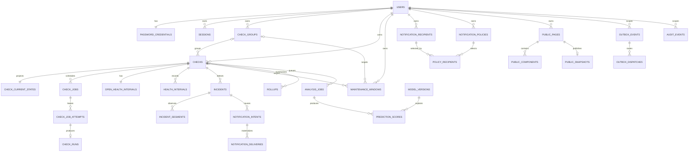

# Database and Persistence Architecture

**Stage:** 3 — Canonical Database and Persistence Architecture  
**Status:** Implemented and verified on local PostgreSQL  
**Date:** 2026-10-10  
**Target Platform:** PostgreSQL 18.6

> This document and its related specifications represent normative architectural contracts. The architecture was finalized on 2026-10-10 and implemented across forward-only migrations, idempotent seed scripts, type-safe data access layers, and integration test suites.

## 1. Documentation Suite

- This document: System boundaries, persistence principles, aggregate mappings, and conceptual ER model
- [`DATABASE_SCHEMA.md`](./DATABASE_SCHEMA.md): Table and column dictionary, data integrity constraints, and indexes
- [`DATABASE_SECURITY.md`](./DATABASE_SECURITY.md): Row-Level Security (RLS), roles, grants, and secure access patterns
- [`DATABASE_OPERATIONS.md`](./DATABASE_OPERATIONS.md): Indexes, queries, partitioning, rollups, retention, migrations, backups, and restore operations
- [`DATABASE_RESTORE_TEST.md`](./DATABASE_RESTORE_TEST.md): Logical backup and restore rehearsal records and boundaries

In the event of contradictions, the order of precedence is: `REQUIREMENTS.md` -> `DOMAIN_MODEL.md` / `STATE_MACHINES.md` -> this persistence suite -> implementation code. When implementation diverges from specifications, documents must be revised in lockstep with formal architectural decision records (`DECISIONS.md`).

## 2. Core Goals and Boundaries

The database architecture guarantees the following capabilities:

- Multi-tenant data segregation enforcing strict ownership boundaries between users
- Horizontal worker scaling without assuming hardcoded check ceilings per user
- Durable scheduling queues, leases, heartbeats, and monotonic fencing tokens
- Independent, high-performance current-state reads for dashboards decoupled from raw historical logs
- Lossless recording of incident confirmation thresholds and observation intervals
- Continuous probe execution and metric collection during maintenance windows while deferring alerts
- Guaranteed single-notification dispatch per incident lifecycle transition
- Public status pages exposing strictly allowlisted projection fields
- Rapid loading of daily, weekly, and monthly historical views via bounded rollup queries
- An optional, isolated early-warning predictor that cannot mutate core health states
- Explicit representation of unobserved data gaps without falsely attributing downtime to targets
- Online, forward-only migrations, automated backups, and verified restore procedures

Version 1 excludes multi-user organization and workspace hierarchies. All private aggregates belong directly to an individual user via `owner_id`. Supporting team workspaces in the future will be evaluated as a distinct domain and migration initiative.

## 3. Core Design Decisions

### 3.1 PostgreSQL as Authoritative Source of Truth

PostgreSQL serves as the sole authoritative source of truth for users, configurations, job queues, current state, incidents, notifications, and historical observations. External dependencies such as Redis, message brokers (Kafka/RabbitMQ), or separate time-series databases are omitted for v1. PostgreSQL transactional outbox tables and durable job queues coordinate asynchronous workloads across processes.

Outbox destinations activate via migration-owned activation and cutover ledgers. Merely declaring an event in the catalog does not trigger dispatches; once activated, durable dispatch and retry policies continue even if consumers experience temporary downtime.

### 3.2 SQL-First Schemas with Type-Safe Kysely Access

To maintain full visibility over PostgreSQL-specific features—including RLS policies, declarative table partitioning, partial indexes, check constraints, and role permissions—migrations are authored as versioned raw SQL. Application repositories execute type-safe queries built with Kysely on top of the standard `pg` driver. Schema lifecycles are decoupled from automated ORM synchronization tools.

### 3.3 Identifiers and Monotonic Versions

- Aggregate roots and domain events use PostgreSQL 18 `uuidv7()` generated identifiers.
- UUIDv7 improves B-tree index locality; however, UUIDs are never treated as security tokens or unguessable public links.
- Public link tokens and session identifiers require at least 256 bits of cryptographically secure entropy, stored exclusively as SHA-256 digests.
- Optimistic concurrency utilizes `resource_version bigint`, probe evaluation semantics use `probe_generation bigint`, scheduling cadences use `schedule_generation bigint`, and active worker leases use monotonic `fencing_token bigint`.
- Version counters start at `1` and increment strictly upon semantic mutations.

### 3.4 Temporal Semantics

- All timestamps are stored in UTC as `timestamptz`; client time zones serve exclusively as presentation metadata.
- Durations are stored as integer milliseconds or seconds; floating-point durations are prohibited.
- Time intervals evaluate as half-open `[start, end)`.
- Lease expirations and freshness deadlines evaluate using database clocks (`statement_timestamp()` / `clock_timestamp()`) to prevent clock skew between application nodes.
- `created_at` records the row insertion timestamp rather than event occurrence time. Execution timelines sort by `scheduled_for`, `started_at`, and `finished_at`.

### 3.5 Text Columns with Named CHECK Constraints

Frequently evolving state machines are persisted as `text NOT NULL` guarded by explicit named `CHECK` constraints rather than native PostgreSQL enum types. This approach simplifies forward-only online migrations when adding new lifecycle states while preserving strict database validation. Application union types and enums are validated against these constraints in CI.

### 3.6 Layered Ownership Defense-in-Depth

- Every tenant-owned table contains an explicit `owner_id` column, avoiding multi-hop joins to determine ownership.
- Parent tables enforce unique constraints on `(owner_id, id)`.
- Child tables enforce composite foreign keys referencing `(owner_id, parent_id)`, preventing cross-tenant foreign key linking at the database level.
- All private tables enforce `ENABLE ROW LEVEL SECURITY` and `FORCE ROW LEVEL SECURITY`.
- Security enforces three complementary layers: API domain authorization, composite schema constraints, and PostgreSQL RLS.

### 3.7 Separation of Authoritative Records from Projections

| Data Domain                           | Nature                          | Reconstructible from History?                                                  |
| ------------------------------------- | ------------------------------- | -----------------------------------------------------------------------------: |
| Check / Group / User Configuration    | Authoritative Source of Truth   | No                                                                             |
| Jobs, Attempts, Accepted/Rejected Runs| Operational Log Record          | No                                                                             |
| Incidents and Observed Segments       | Domain Lifecycle Record         | Theoretically derivable from raw runs; treated as authoritative in normal ops  |
| Check Current State                   | Dynamic Projection              | Yes                                                                            |
| Open Health Intervals                 | Dynamic Projection / Work State | Yes                                                                            |
| Minute / Hour Rollups                 | Precomputed Aggregation         | Yes                                                                            |
| Public Status Snapshots               | Allowlisted Public Projection   | Yes                                                                            |
| Prediction Scores                     | Advisory Feature Output         | Yes (if model inputs are retained)                                             |

Projection updates commit atomically within the same database transaction as the triggering domain write and outbox event. Asynchronous rebuilds operate as distinct, idempotent recovery procedures.

### 3.8 Declarative Partitioning for High-Volume Historical Tables

`monitoring.check_runs`, `monitoring.health_intervals`, minute/hour rollups, prediction scores, and audit tables utilize declarative range partitioning bounded by month. Because PostgreSQL requires partitioned tables to include partition keys in primary keys, the primary key for check runs is composite: `(owner_id, check_id, finished_at, id)`. Explicitly including `check_id` ensures that all historical run references enforce tenant and check lineage at the database level.

### 3.9 Bounded JSONB Usage

JSONB is restricted to bounded, rarely queried configuration metadata: frozen probe configuration snapshots, sanitized event payloads, predictor feature rationales, and public snapshot DTOs. Columns involved in filtering, joining, indexing, or foreign key constraints use standard SQL types. All JSON payloads are validated against application schemas and enforce byte size constraints.

## 4. PostgreSQL Schema Boundaries

| Schema          | Architectural Responsibility                                            |
| --------------- | ----------------------------------------------------------------------- |
| `infra`         | Migration ledger, schema compatibility, outbox events, and dispatches   |
| `auth`          | Users, password credentials, session tracking, and single-use tokens    |
| `app`           | Check definitions, group memberships, and maintenance windows           |
| `monitoring`    | Check jobs, attempts, runs, current state, health intervals, rollups    |
| `notification`  | Alert recipients, delivery policies, intents, and dispatch tracking     |
| `public_status` | Public page configurations, component mappings, and published snapshots |
| `prediction`    | Analysis jobs, model registry, and advisory risk scores                 |
| `audit`         | Append-only security and domain audit events                            |
| `security_api`  | Restricted `SECURITY DEFINER` procedures; contains zero tables          |

Application objects are never created in the default `public` schema; `CREATE` privileges are revoked from runtime roles and `PUBLIC`. All queries schema-qualify object names, and connection pools enforce fixed, safe `search_path` settings.

## 5. Aggregate Root and Transaction Boundaries

| Domain Operation             | Root Entity Locked              | Written in Same Atomic Transaction                                                             |
| ---------------------------- | ------------------------------- | ---------------------------------------------------------------------------------------------- |
| Create / Update Check        | `app.checks`                    | Check row, initial current state, audit log, outbox event                                      |
| Pause / Resume / Delete      | `app.checks` + current state    | Generation counters, cadence anchors, active interval/incident modes, job cancellation, outbox|
| Scheduler Job Enqueue        | Due check record                | `next_run_at`, check job, coalesced manual intent consumption                                  |
| Job Claim / Reclaim          | `monitoring.check_jobs` + check | Worker lease, job attempt, monotonic fencing token                                             |
| Probe Observation Acceptance | Check + current state + job     | Immutable run, state update, health interval, incident/segment, outbox, terminal job transition|
| Freshness Reconciliation     | Current state + check           | Active interval close/open, incident unobserved transition, state version increment, outbox    |
| Maintenance Window Mutation  | Maintenance window record       | Resource version, audit event, reconciliation outbox event                                     |
| Notification Materialization | Notification intent record      | Policy resolution snapshot and per-recipient delivery tasks                                    |
| Public Page Configuration    | Public status page record       | Component mappings, page revision increment, allowlist snapshot refresh, audit event           |

Every stateful probe observation acceptance transaction atomically compares the check's current `probe_generation`, `schedule_generation`, and latest fencing token. Runs with mismatched tokens are persisted as `accepted_for_state = false` without mutating current state or incidents.

## 6. Conceptual Entity-Relationship (ER) Model

## 7. Database Enforcement of Critical Business Rules

### No Concurrent Executions for a Single Check

A partial unique index on `monitoring.check_jobs` enforces at most one row per check in `PENDING`, `LEASED`, or `RUNNING` status. Manual execution requests arriving while a job is in flight coalesce into the `checks.manual_requested_at` timestamp flag. When the active job finishes, at most one manual job is enqueued.

### Single Transient Failures Do Not Open Incidents

An initial accepted `FAIL` transitions current state to `SUSPECT` and opens a provisional unconfirmed interval. A second consecutive accepted `FAIL` backdates the incident start timestamp to the initial failure and finalizes the interval as `DOWN`. If an accepted `PASS` arrives before the second failure, the provisional interval resolves to `UP` without opening an incident.

### Unobserved Data Gaps Are Not Target Downtime

When `fresh_until` deadlines expire, read models project the check as `UNKNOWN/STALE` immediately. Background reconcilers close open active intervals at `fresh_until` and initialize an `UNKNOWN` gap interval. System outages do not fabricate synthetic `FAIL` records; availability rollups record lower data coverage rather than false downtime.

### Maintenance Suppresses Alerts Without Pausing Probes

Probes, run records, and health transitions continue unimpeded during maintenance windows. Incident transitions emit notification intents; during evaluation, intents matching active check or group maintenance evaluate to `DEFERRED_MAINTENANCE`. When maintenance concludes, unresolved incidents emit a single `DOWN` alert; recovered incidents emit zero alerts.

### Public Status Pages Never Query Private Tables Directly

Public API endpoints execute zero joins against private check, group, or user tables. Publishing workflows materialize an allowlisted JSON payload into `public_status.snapshots`. Anonymous callers invoke narrow `SECURITY DEFINER` functions using slug digests. Revoking or rotating a public token invalidates snapshot access immediately within the same transaction.

### Predictor Cannot Mutate Core Operational State

The Python predictor reads security-barrier feature views and writes advisory outputs to the `prediction` schema. It holds zero `INSERT`, `UPDATE`, or `DELETE` grants on checks, current state, incidents, notifications, or public snapshots. Unavailability of the predictor has zero impact on core monitoring or API readiness.

## 8. Resource Deletion and Data Lifecycle

- **Checks:** Soft-deleted via `lifecycle_state = DELETED` and `deleted_at`. Automated scheduling and public status projections cease immediately. Historical data is retained through configured retention windows before background purging.
- **Groups:** Checks detach into an ungrouped state within the transaction, and the group record is marked soft-deleted. Historical maintenance references remain intact.
- **Users:** Transitioning to `DELETION_REQUESTED` revokes sessions and halts background jobs. Partitioned high-volume historical tables are pruned in bounded batches before hard-deleting the user entity.
- **Sessions / Tokens:** Hard-deleted upon expiry or revocation following a short security retention grace period.
- **Public Snapshots:** Hard-deleted immediately upon page deactivation, slug rotation, or page deletion.
- **Runs / Rollups / Outbox / Audit:** Pruned via automated retention policies and partition detachment. Broad `ON DELETE CASCADE` triggers across large historical tables are avoided.

## 9. Capacity and Scalability Model

The architecture is not bound by 50-check limits. Average probe dispatch rate approximates `active_checks / average_interval_seconds`. For example, 500 checks configured on 30-second intervals generate ~16.7 probes/s and ~43.2 million raw runs monthly. This reference workload dictates the partition and rollup strategy.

Scaling Strategy:

1. Scale monitor worker replicas horizontally; `SKIP LOCKED`, leases, and monotonic fencing tokens prevent race conditions.
2. Budget database connection pools against PostgreSQL limits; add PgBouncer in transaction pooling mode as connection concurrency grows.
3. Configure raw data retention and rollup aggregation windows according to available storage capacity.
4. Offload heavy analytical queries to dedicated read replicas if required by future growth.

## 10. Implementation and Verification Summary

The following architectural components are implemented and verified:

- Schema definitions, constraints, and composite foreign keys
- Multi-tenant ownership and PostgreSQL Row-Level Security (RLS)
- Composite run identifiers and monthly range partitioning
- Decoupling of current state projections from immutable historical runs
- Trust boundaries for notifications, public snapshots, and advisory predictions
- Automated retention lifecycles, RPO/RTO objectives, and backup restore procedures
- SQL-first forward-only migration pipeline with advisory locking and SHA-256 checksum verification

The `migrate` service runs prior to application containers in Docker Compose. Comprehensive integration test suites validate clean schema creation, migration idempotency, checksum drift detection, RLS isolation, cross-tenant foreign key rejection, role privileges, and backup restore workflows.
