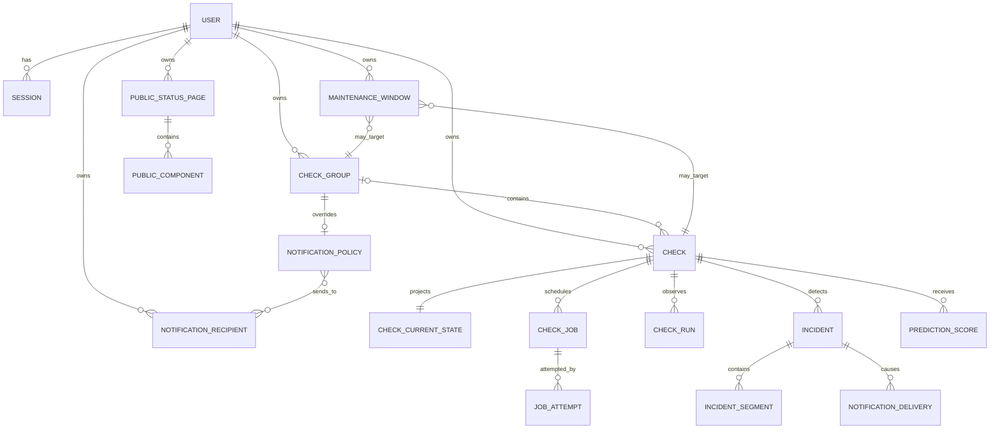

# Site Availability Monitor — Domain Model

**Version:** 1.0  
**Status:** Final domain model for Phase 1  
**Date:** 2026-10-09 22:53 +06:00  
**Foundation:** `REQUIREMENTS.md`, `DECISIONS.md`, `GLOSSARY.md`

## 1. Purpose and Boundaries

This document defines the product's business domain, aggregate boundaries, ownership rules, commands, events, and transaction boundaries. It does not contain table, column, index, or ORM details; those will be determined in the Phase 3 database architecture based on this model.

The domain model upholds the following principles:

- Strict resource isolation between users
- Separation of check configuration from high-frequency observation state
- Immutability of raw run observations
- Sequential and idempotent application of state and incident transitions
- Monitoring gaps are not treated as target downtime
- Decoupling of notifications, public projections, and predictions from core health decisions
- Asynchronous side effects driven by durable domain events

## 2. Domain Modules

### Identity

Manages user identity, password state, verification, and session lifecycles.

### Monitoring Configuration

Manages check and group configurations, ownership, config versions, pause/resume/delete, and manual-run commands.

### Scheduling and Execution

Manages cadence, jobs, leases, attempts, fencing tokens, and the generation of immutable check runs.

### Health and Incidents

Derives current health, freshness, failure candidates, incidents, and observed segments from accepted observations.

### Maintenance

Manages scheduled notification suppression windows at check or group scope.

### Notifications

Manages recipients, notification preferences, intents, and delivery lifecycles.

### History and Availability

Generates immutable runs, health timelines, incident segments, rollups, and availability/coverage projections.

### Public Status

Generates unauthenticated and restricted public projections from attributes explicitly selected by the owner.

### Prediction

Generates feature snapshots and time-bounded risk scores without mutating the core domain.

## 3. Conceptual Relationship Model



The diagram is purely conceptual. A maintenance window targets either a check or a group at a time; it cannot use both targets simultaneously.

## 4. Common Identity and Value Objects

### Identifiers

All domain identifiers must be globally unique, opaque, and resistant to public guessing. The application layer never infers the owner from an identifier; ownership is always verified independently.

### OwnerId

Mandatory on every private aggregate. Child entities inherit their owner through the aggregate; cross-aggregate associations enforce owner equality.

### Instant and Duration

- Persisted timestamps are UTC instants.
- User locale/timezone information is solely for display purposes.
- Duration measurements use monotonic clocks whenever possible; wall clock is stored solely for event timestamps.
- Maintenance windows are represented as half-open intervals: `[starts_at, ends_at)`.

### ResourceVersion

Incremented on every user mutation to provide optimistic concurrency control. An update command may supply the expected resource version; mismatches produce a conflict.

### ProbeGeneration

Incremented when any of the following attributes change:

- URL
- Timeout or HTTP behavior
- Expected status code
- Expected body string
- Probe semantics such as redirects or TLS

Runs belonging to an older probe generation cannot be applied to state or incidents.

### ScheduleGeneration

Incremented under the following conditions:

- Interval modification
- Pause
- Resume
- Delete
- Operations resetting the cadence

Queued jobs belonging to an older schedule generation are cancelled or cannot be applied to state.

### ConfigSnapshot

An immutable snapshot of probe attributes captured when a job is scheduled. Even if the check is edited while a worker is running, the conditions under which the run was evaluated remain unchanged.

### FailureCategory

Comprises at least the following stable categories:

- `DNS_ERROR`
- `CONNECT_ERROR`
- `TLS_ERROR`
- `TIMEOUT`
- `TOO_MANY_REDIRECTS`
- `BLOCKED_TARGET`
- `RESPONSE_TOO_LARGE`
- `UNEXPECTED_STATUS`
- `BODY_MISMATCH`
- `PROTOCOL_ERROR`
- `UNKNOWN_NETWORK_ERROR`

Worker/internal programming errors or infrastructure failures are never classified as target site failures.

## 5. Aggregates and Entities

### 5.1 User Aggregate

**Aggregate root:** `User`

**Responsibilities:**

- Preserving the normalized uniqueness of email identity
- Managing password credential state
- Managing account verification and deactivation states
- Storing user display timezone/locale preferences

**Core states:**

- `PENDING_VERIFICATION`
- `ACTIVE`
- `DISABLED`
- `DELETION_REQUESTED`

**Invariants:**

- A disabled or deletion-requested account cannot establish new sessions.
- Checks belonging to a disabled or deletion-requested owner do not generate new scheduled jobs; public pages are disabled and queued notification deliveries are not sent.
- Password hashes never enter domain events, logs, or API responses.
- Account deletion initiates a separate, auditable purge process for owned data.

For security reasons, `Session` is managed as a high-churn entity/repository independent of the User aggregate. Revoking a session does not require locking the User record.

### 5.2 Check Group Aggregate

**Aggregate root:** `CheckGroup`

**Core fields:**

- Identity and owner
- Name and optional description
- Notification policy association
- Optional defaults for public visibility
- Resource version
- Creation/update timestamps

**Invariants:**

- A group and its associated checks must belong to the same owner.
- Uniqueness of group names within a user scope is not a product requirement; duplicate names may be permitted.
- Deleting a group does not delete its checks. Checks atomically become ungrouped.
- Deleting a group halts the generation of new group-scoped maintenance windows or notifications.
- Existing notification delivery records are not deleted.

Group health is not a persisted truth within the aggregate; it is a reproducible projection derived from check current-state data.

### 5.3 Check Aggregate

**Aggregate root:** `Check`

**Core field groups:**

- Identity, owner, and optional group
- Display name
- Probe configuration
- Schedule configuration
- Lifecycle: `LIVE` or `DELETED`
- Execution: `ACTIVE` or `PAUSED`
- Resource version
- Probe generation
- Schedule generation
- Cadence anchor and `next_run_at`
- Creation, update, and optional deletion timestamps

**Invariants:**

- URL must be HTTP or HTTPS and must satisfy security policy.
- Interval ranges from 30 seconds to 1 hour.
- Timeout is positive and below the deployment safety ceiling; it may be longer than the interval.
- Expected status is within the valid HTTP status range.
- Body expectation is bounded by size and encoding policy.
- A deleted check cannot produce new jobs or manual runs.
- A check belongs to at most one group.

**Commands:**

- `CreateCheck`
- `ChangeDisplayMetadata`
- `ChangeProbeConfiguration`
- `ChangeScheduleInterval`
- `MoveCheckToGroup`
- `PauseCheck`
- `ResumeCheck`
- `RequestManualRun`
- `DeleteCheck`

**Command semantics:**

- Display name change only increments resource version.
- Group change does not reset health; maintenance/notification scope is taken from the new group in subsequent evaluations.
- Probe configuration change increments probe generation, invalidates older queued jobs, clears failure candidates, and sets effective health to UNKNOWN until a new valid observation is recorded.
- When probe configuration changes, open incidents are closed with the `CONFIG_CHANGED` reason; a closure event indicating "monitoring definition changed, not confirmed recovery" is produced for recipients that previously received DOWN alerts.
- Interval change increments schedule generation and starts a new cadence from the moment of change; it does not reset health. The `fresh_until` value of the current accepted observation is recalculated based on the new interval.
- Pause increments schedule generation, cancels queued jobs, and invalidates running job results for state updates. Last known health is retained, but effective health becomes stale/UNKNOWN.
- Resume increments schedule generation, marks the check ACTIVE, and schedules the first automated run as soon as possible. Effective health remains UNKNOWN until a new result arrives.
- Delete is terminal: the check immediately disappears from private and public queries, scheduling stops, queued jobs are cancelled, running results are rejected, and open incidents are closed with `CHECK_DELETED`. Physical purging may be asynchronous in accordance with retention/privacy policies.

### 5.4 Check Current State Projection/Aggregate

`CheckCurrentState` is a singleton state record read quickly for dashboards and locked within the transaction during observation acceptance.

**Core fields:**

- Check and owner identity
- Last observed health
- Freshness data for effective health
- Consecutive failure count
- Failure candidate start time and first run ID
- Open incident ID
- Last accepted run/fencing token
- Last successful and last failed run timestamps
- Last response time, status, and failure category
- `fresh_until`
- State version

**Invariants:**

- Only accepted observations can mutate state.
- Fencing tokens increase monotonically; lower or equal stale tokens are never reapplied.
- Runs with mismatched probe or schedule generations cannot mutate state.
- Applying the same accepted run a second time produces no state change (idempotent).
- The projection does not replace raw run history and can be rebuilt if necessary.

### 5.5 Check Job Aggregate

**Aggregate root:** `CheckJob`

**Purpose:** To persist and make claimable an intended scheduled or manual check execution.

**Core fields:**

- Check and owner
- Trigger: `SCHEDULED` or `MANUAL`
- Manual mode: `STATEFUL` or `DIAGNOSTIC`
- `scheduled_for`
- Config snapshot
- Probe and schedule generation
- Job state
- Attempt count
- Lease owner, lease expiry, and heartbeat
- Fencing token

**Invariants:**

- The combination of queued/running jobs per check is deduplicated by domain rules.
- Repeated manual requests coalesce into at most one pending manual intent.
- Manual runs on an ACTIVE check are `STATEFUL`; on a PAUSED check, they are `DIAGNOSTIC`.
- Diagnostic runs do not alter health, incidents, availability, or normal notifications.
- Target failure is not a job failure; if a worker reached the target and classified the outcome, the job is `COMPLETED`.
- Internal worker failures may be retried without generating an observation.

### 5.6 Job Attempt Entity

Each acquired lease constitutes an attempt. An attempt carries worker identity, fencing token, start time, heartbeat, completion time, and terminal reason.

Attempt history:

- Exists for operational debugging.
- Does not directly affect check availability.
- A late result from an attempt that lost its lease can be recorded as a run but cannot become an accepted observation.

### 5.7 Check Run Entity

`CheckRun` is an immutable observation; once created, its execution outcome cannot be modified.

**Core fields:**

- Owner, check, job, and attempt identity
- Trigger and manual mode
- Probe/schedule generation and fencing token
- Scheduled, started, and finished timestamps
- Monotonic duration measurements
- DNS/connect/TLS/TTFB/total timing values — to the extent supported
- HTTP status
- Body-match result
- `PASS` or `FAIL`
- Failure category and sanitized brief diagnosis
- `accepted_for_state` and rejection reason

**Invariants:**

- Raw response bodies are never stored.
- Internal errors are never synthesized as target FAIL observations.
- Results cannot be modified between PASS and FAIL post hoc.
- Redacted diagnoses cannot contain secret query parameters, credentials, or response bodies.

### 5.8 Failure Candidate

A failure candidate is not a separate aggregate root; it is provisional health information held inside CheckCurrentState.

Upon first accepted FAIL:

- Health becomes `SUSPECT`.
- Candidate start time and first run ID are recorded.
- No incident or DOWN notification is generated.

Subsequent accepted outcome:

- If FAIL, the candidate is confirmed, an incident is opened, and the first failure timestamp becomes the incident start time.
- If PASS, the candidate is dismissed; provisional duration is not counted as confirmed downtime.
- Data gaps, pause, probe change, or deletion clear the candidate without confirming it.

### 5.9 Incident Aggregate

**Aggregate root:** `Incident`

**Core fields:**

- Owner and check
- First failure run
- Confirmation run and timestamp
- `started_at`
- Status: `OPEN` or `CLOSED`
- Observation mode: `OBSERVED` or `UNOBSERVED`
- Closure time and closure reason
- Aggregate observed duration
- Wall-clock span — derived
- Last failure category
- Notification summary projection

**Closure reason:**

- `RECOVERED`
- `CONFIG_CHANGED`
- `CHECK_DELETED`

A pause or monitoring gap does not close an incident; it terminates the active observed segment and transitions the incident to `UNOBSERVED`. Thus, a subsequent initial success can resolve the same incident as a genuine recovery, but unobserved intervals are not added to the downtime duration.

**Invariants:**

- A check has at most one open incident.
- An incident is created only when the failure threshold is crossed.
- `started_at` is the timestamp of the initial failure candidate.
- `confirmed_at` is the timestamp of the run crossing the threshold.
- Observed duration is strictly the sum of incident segments.
- A closed incident cannot be reopened; if needed, a new incident is created.
- Reapplying the same event produces no new incident or segment.

### 5.10 Incident Segment Entity

A half-open time interval `[segment_start, segment_end)` during which the incident was actively observed as DOWN.

- The first segment begins at the candidate start time.
- Freshness STALE, pause, or probe generation change terminates the segment.
- If an accepted FAIL arrives while an incident is open, a new segment can begin.
- An accepted PASS closes the active segment and the incident.
- Segments of the same incident cannot overlap.

The "confirmed downtime duration" displayed to the user is the sum of segments. If wall-clock span is also displayed, the presence of data gaps must be explicitly highlighted.

### 5.11 Maintenance Window Aggregate

**Aggregate root:** `MaintenanceWindow`

**Core fields:**

- Owner
- Target type: `CHECK` or `GROUP`
- Target identity
- Name/description
- `starts_at` and `ends_at`
- Lifecycle: `SCHEDULED`, `CANCELLED`; `ACTIVE/ENDED` derived over time
- Resource version

**Invariants:**

- Target and maintenance window belong to the same owner.
- Must satisfy `starts_at < ends_at`.
- The interval is half-open: `[starts_at, ends_at)`.
- Active windows for a check are the union of direct and group-inherited windows.
- Maintenance does not alter health or run generation; it only affects notification eligibility and UI projections.

Active maintenance windows can be edited or cancelled. Every change generates a reconciliation event; open incidents and pending notification intents are re-evaluated against the latest truth.

### 5.12 Notification Recipient and Policy

`NotificationRecipient` is a user-owned email destination.

**Recipient state:**

- `PENDING_VERIFICATION`
- `VERIFIED`
- `DISABLED`

Only a VERIFIED recipient can receive operational deliveries.

`NotificationPolicy` operates at two levels:

- User default
- Group override or default inheritance

Moving a check to another group affects the policy in effect at dispatch time for un-sent DOWN notifications. Recipients that previously received DOWN notifications serve as the source of truth for recovery/closure matching.

### 5.13 Outbox Event

An outbox event is an immutable message written within the same transaction as the domain mutation.

**Event envelope:**

- Event ID
- Event type and schema version
- Owner ID
- Aggregate type, ID, and version
- Occurred at
- Correlation ID
- Optional causation ID
- Minimal and redacted payload

Event consumers must be idempotent based on event ID. The payload does not substitute for re-authorization or persistent state; consumers re-read the source of truth when necessary.

### 5.14 Notification Intent and Delivery

`NotificationIntent` is a policy evaluation record for an incident event. `NotificationDelivery` corresponds to a single recipient and a single event kind.

**Intent examples:**

- Incident opened/down
- Incident recovered
- Incident administratively closed/config changed
- Predictive warning

**Delivery identity:**

`incident + event kind + recipient` forms the unique business key.

At the time of DOWN dispatch, active maintenance and recipient policies are re-read. RECOVERY or closure deliveries are only produced for recipients that had a prior successful DOWN delivery.

### 5.15 Public Status Page Aggregate

**Aggregate root:** `PublicStatusPage`

**Core fields:**

- Owner
- Display title/description
- Lifecycle: `DRAFT`, `PUBLISHED`, `DISABLED`
- Slug/token digest and revision
- Selected components
- Field visibility policy
- Resource version

**Invariants:**

- Components and page must belong to the same owner.
- Disabled or draft pages do not return public data.
- Slug rotation invalidates previous URLs.
- By default, real URLs and private details are not published.
- Public projections are assembled solely from allowlisted fields; private DTOs are never filtered down into public DTOs.

### 5.16 Prediction Score and Analysis Job

`AnalysisJob` represents the most up-to-date analysis requirement per check, and older requests can be coalesced.

`PredictionScore` is an immutable, advisory result:

- Owner and check
- Calculation timestamp
- Prediction horizon
- Score and risk level
- `valid_until`
- Model/algorithm version
- Feature snapshot/version
- Redacted explanatory reasons

Prediction state may reference the main health state, but cannot mutate it. An expired prediction is not an effective result.

### 5.17 Audit Event

Records sensitive user and system mutations in an append-only fashion:

- Who performed the action, when, and on which resource
- Action type and outcome
- Correlation/request ID
- Secure, redacted change summary

Audit events never contain passwords, session tokens, response body content, or sensitive URL parameters.

## 6. Command Behaviors and Edge Cases

### Create Check

- Check is created in ACTIVE state.
- Since there is no data for health yet, effective health is UNKNOWN and freshness is STALE.
- First scheduled job is scheduled as soon as possible with jitter.

### Pause Check

- No new scheduled jobs are produced.
- Queued scheduled jobs are cancelled.
- Cancellation of running attempts is requested; late results are rejected for state updates.
- Failure candidate is cleared.
- The active segment of an open incident closes at pause time; the incident remains unobserved.
- Last observed health is retained diagnostically; effective health is displayed as UNKNOWN/STALE.

### Resume Check

- Check becomes ACTIVE and receives a new schedule generation.
- First job is scheduled immediately or with very short jitter.
- Effective health remains UNKNOWN until the first accepted result.
- If there was a previously open incident, the first FAIL starts a new observed segment; the first PASS closes the incident as RECOVERED.

### Manual Run

- If the check is ACTIVE, it runs statefully and participates in the same state machine as scheduled runs.
- If the check is PAUSED, it runs diagnostically; its result is marked separately in history but does not change health, incidents, availability, or normal notifications.
- Manual runs do not shift the cadence.
- If there is an active job, at most one pending manual intent is retained.

### Probe Configuration Change

- Probe generation increments.
- Older queued/running results become invalid for state updates.
- Candidate is cleared and effective health becomes UNKNOWN.
- Open incidents are closed with CONFIG_CHANGED; observed segment ends at the moment of change.
- A check is scheduled as soon as possible for the new config.

### Schedule Interval Change

- Schedule generation increments.
- The moment of change becomes the new cadence anchor.
- `next_run_at = changed_at + new_interval`.
- Existing health and incidents are preserved.
- `fresh_until` is recalculated as last accepted run timestamp + new interval + timeout/grace; if the resulting time is in the past, state becomes STALE immediately.

### Move Check to Group

- Health and incidents do not change.
- New maintenance and notification evaluations are performed against the new group.
- Recipients who previously received DOWN deliveries are retained for recovery matching.

### Delete Check

- Resource immediately disappears from user and public queries.
- Scheduling stops; queued jobs are cancelled and running results are rejected.
- Candidate is cleared.
- Open incidents close with CHECK_DELETED.
- Pending normal notification intents/deliveries are cancelled.
- Physical purging of raw history and audit data is subject to retention/privacy policies.

### Delete Group

- Checks are not deleted; they become ungrouped.
- Group maintenance and notification policies become invalid for new operations.
- Public group component is removed or disabled with page revision.
- Dispatched DOWN delivery records are retained for recovery matching.

## 7. Observation Acceptance Procedure

When a run completes, the following sequence is executed within a single transaction:

1. Validate job/attempt identity and idempotency.
2. Insert immutable CheckRun or fetch existing record if the run was previously recorded.
3. Lock Check and CheckCurrentState.
4. Evaluate lifecycle, generation, fencing token, and manual mode.
5. Finalize the run's `accepted_for_state` decision and rejection reason.
6. If rejected, the transaction only writes the diagnostic run and job terminal state.
7. If accepted, run the freshness and health state machine.
8. If needed, create or close incidents/segments.
9. Record domain changes for availability timeline/projections.
10. Insert required outbox events within the same transaction.
11. Transition job to terminal state and commit the transaction.

This transaction never sends SMTP emails, writes to SSE connections, or invokes the predictor.

## 8. Transaction Boundaries

### Configuration transaction

Check/group changes, generation/version increments, job invalidation, state resets, and related outbox events are committed together.

### Observation transaction

Run, current state, incident segment, incident, and outbox changes are committed together.

### Maintenance transaction

Maintenance window changes and reconciliation requests are committed together. It is not mandatory to update all incidents in the same user transaction.

### Notification transaction

Intent evaluation and delivery creation constitute an idempotent transaction. SMTP dispatch is executed outside the transaction; outcomes are recorded in a separate transaction.

### Public page transaction

Page/component/visibility modifications and page revision increment are committed together.

### Prediction transaction

Analysis job terminal state and the new prediction score can be committed together; core monitoring tables cannot be written.

## 9. Derived Projections

The following are reproducible read models, not sources of truth:

- Dashboard check current state
- Group current health
- Daily/weekly/monthly response-time rollups
- Availability and coverage buckets
- Incident notification summary
- Public status snapshot
- Latest valid prediction

Projection lag does not alter domain truth. When appropriate, the API returns `as_of`/`updated_at` information to convey data age to the user.

## 10. Group Health Derivation

Only checks with lifecycle LIVE and execution ACTIVE contribute to group health calculation.

Precedence:

```text
DOWN > SUSPECT > UNKNOWN > UP
```

Rules:

- Effective health of a check with freshness STALE is UNKNOWN.
- If at least one check is DOWN, the group is DOWN.
- If there are no DOWN checks and at least one SUSPECT, the group is SUSPECT.
- If there are no DOWN or SUSPECT checks and at least one UNKNOWN, the group is UNKNOWN.
- If all included checks are UP, the group is UP.
- If there are no active checks in the group but paused checks exist, execution summary is PAUSED, health summary is UNKNOWN.
- If the group is empty, health is UNKNOWN and `empty=true` is returned.

Maintenance summary is separate from health and may be derived as `NONE`, `PARTIAL`, or `FULL`.

## 11. Timeline and Data Gaps

Every accepted stateful run produces a new `fresh_until`. The value is determined considering the next expected cadence, the effective timeout for that job, and scheduler grace.

When `fresh_until` elapses and no newer accepted run exists:

1. Freshness becomes STALE.
2. Effective health becomes UNKNOWN; last observed health is preserved.
3. Failure candidate is cleared.
4. The active observed segment of an open incident closes at the `fresh_until` timestamp.
5. The incident may remain open but in an UNOBSERVED state.
6. The availability timeline produces UNKNOWN after `fresh_until`.

When a new accepted run arrives:

- If PASS, open incident closes as RECOVERED; the gap is not added to DOWN duration.
- If FAIL and an open incident exists, a new observed DOWN segment begins.
- If FAIL and no open incident exists, a new failure candidate begins.

## 12. Domain Event Catalog

Initial event family:

### Configuration

- `user.created`
- `user.disabled`
- `check.created`
- `check.metadata_changed`
- `check.probe_configuration_changed`
- `check.schedule_changed`
- `check.paused`
- `check.resumed`
- `check.group_changed`
- `check.deleted`
- `group.created`
- `group.changed`
- `group.deleted`

### Execution and health

- `check.manual_run_requested`
- `check.job_available`
- `check.run_recorded`
- `check.observation_accepted`
- `check.observation_rejected`
- `check.health_changed`
- `check.freshness_changed`
- `incident.opened`
- `incident.observation_suspended`
- `incident.observation_resumed`
- `incident.closed`

### Maintenance and notification

- `maintenance.created`
- `maintenance.changed`
- `maintenance.cancelled`
- `maintenance.reconciliation_requested`
- `notification.intent_created`
- `notification.delivery_scheduled`
- `notification.delivery_sent`
- `notification.delivery_failed`

### Public and prediction

- `public_page.published`
- `public_page.changed`
- `public_page.disabled`
- `prediction.requested`
- `prediction.updated`
- `prediction.expired`

Event names will be versioned in the event contract document prior to implementation. This catalog fixes domain scope, not payload schemas.

## 13. Non-Domain Layer Responsibilities

- HTTP framework and routing details
- SQL table and index names
- SMTP provider details
- SSE connection management
- Chart bucket resolutions
- Python libraries or model algorithms
- Container/orchestrator configuration

These concerns invoke domain rules but cannot alter them.

## 14. Domain Model Completion Checklist

- Every private aggregate carries an owner.
- Check config, job, run, current state, and incident are decoupled from each other.
- Behaviors for manual run, pause, resume, edit, group move, and delete are defined.
- Stale runs and lease loss are prevented from corrupting state.
- Relationships between data gaps, incident duration, and availability are defined.
- Maintenance, notifications, and public projections are decoupled from the core health truth.
- The predictor has no write authority over the core domain.
- Transaction and event boundaries for critical mutations are defined.
